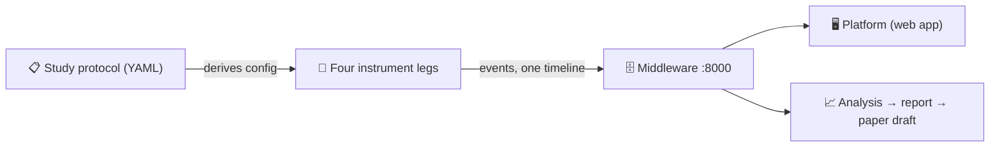

# Contributing

Thanks for your interest in improving the platform. This guide covers
setup, the quality gates, the architecture you'll be working inside, and
the few rules that keep the science sound.

## Setup

Prerequisites: **Python 3.12 + [uv](https://docs.astral.sh/uv/)**,
**Node ≥ 22**, VS Code ≥ 1.85. Docker is optional (composed stack,
SonarQube).

```bash
# Python: one workspace venv at the repo root (uv manages it; never pip/venv by hand)
uv sync --all-packages

# Node components
(cd extension && npm install)
(cd platform && npm install)

# Optional: mirror the CI gate at commit time
uv run pre-commit install
```

## Quality gates (all must stay green)

```bash
uv run pytest                 # all Python tests
uv run ruff check .           # Python lint (config in the root pyproject.toml)
(cd extension && npm run check)   # typecheck + lint + format + tests
(cd platform && npm run check)   # tsc + lint + verify + build
bash scripts/smoke.sh         # full-stack proof: bring-up → ingest → report → paper
```

CI runs the same four gates on every push, plus a build of the middleware
Docker image.

## Architecture in one pass

A study is declared in **one validated YAML protocol** ("study-as-code");
the platform derives everything else from it: instrument configuration,
lifecycle gates, task cards, analysis, and the paper draft.



| Directory | What it is | Language / gate |
| --------- | ---------- | --------------- |
| `protocol/` | Study-as-code schema, validation, lifecycle, config derivation | Python, `uv run pytest protocol` |
| `extension/` | VS Code extension: self-report + behavioral capture. Deep guide: [`extension/PROJECT_GUIDE.md`](extension/PROJECT_GUIDE.md) | TypeScript, `npm run check` |
| `metrics/` | Nine code-complexity measurements (deliberately flat scripts, not a package) | Python |
| `agent-capture/` | The AI agent's side of a session: hooks, transcripts, snapshots, task harness | Python |
| `middleware/` | The hub on port 8000: ingestion, storage, query API, serves the platform | Python (FastAPI + PostgreSQL; SQLite fallback) |
| `platform/` | The web app: design conversation, study workspace (Library / Data / Lifecycle), projects, evolution surfaces | React 19 + Vite + Tailwind + shadcn, `npm run check` |
| `analysis/` | Analysis recipes → per-question report → LaTeX paper draft → retrospective | Python |

New Python packages use the src layout (`<pkg>/src/<pkg>/`), hatchling,
and join `[tool.uv.workspace].members` in the root `pyproject.toml`.

## The rules that keep the science sound

These invariants are why the data is publishable; breaking one breaks
the study, not just the build:

1. **Join keys everywhere.** Every data row of every leg carries the
   participant ID, condition, session ID, timestamp, and a schema version.
   A data source that can't provide them doesn't ship.
2. **Schema versions, never guesses.** Any change to an event's shape or
   meaning bumps the schema version (`extension/src/core/types.ts`) or the
   protocol version; consumers branch on the version.
3. **Never interrupt the participant.** Sensors are fire-and-forget: no
   blocking, no focus stealing, no perceptible latency. Failures are
   swallowed, counted, and reported once. Local JSONL is the source of
   truth; network mirroring is best-effort, and loss must be *detectable*
   (sequence-number gaps), even where it isn't preventable.
4. **Privacy by construction.** No raw code content, keystrokes, or
   clipboard text in any instrument: aggregates, shapes, and salted
   hashes only. The two scoped exceptions (agent-conversation content,
   workspace snapshots) are governed by the protocol's consent-matched
   content policy. The knowledge assistant can only ever see aggregates;
   enforced server-side and tested.
5. **Participant data never enters git.** `.study-data/`, `*.sqlite3`,
   `results/`, and `shadow.git/` are gitignored; keep it that way.
6. **Honest statistics.** Exact tests, effect sizes, per-group sample
   sizes; never a bare p-value.
7. **The extension's core stays IDE-agnostic.** `extension/src/core` never
   imports `vscode`; that's what makes the scientific logic portable and
   testable.
8. **External services are optional and replaceable.** Semantic Scholar,
   the LLM provider, SonarQube, and auth providers all sit behind
   graceful-degradation seams: cache, warn once, never block a session,
   keep working offline. New integrations follow the same pattern.

## Requirements and decisions (the formal layer)

Public docs stay in plain language, but the project keeps a complete
requirements record underneath:

- Every feature traces to a numbered requirement in
  [`requirements/srs.md`](requirements/srs.md); implementation status
  lives in [`requirements/traceability.md`](requirements/traceability.md).
- Adding a dependency, tool, or external service? Record an
  adopt/adapt/build/reject decision with rationale in
  [`requirements/build-vs-adopt.md`](requirements/build-vs-adopt.md) first.
- Requirement IDs are stable anchors: don't renumber them.
- [`requirements/glossary.md`](requirements/glossary.md) owns terminology:
  it's `participant` (not user), `condition` (not group), `recipe` (not
  script), in identifiers, schema fields, and docs.
- The phase plan, phase by phase: [`docs/roadmap/`](docs/roadmap/README.md).

## Style

- Match the style of the file you're in. Prettier/ESLint own the extension's
  and platform's formatting; ruff owns Python (line length 88).
- Time-dependent logic gets an injected clock and mocked-timer tests (see
  `extension/test/` for the pattern).
- Run the gates before committing.
