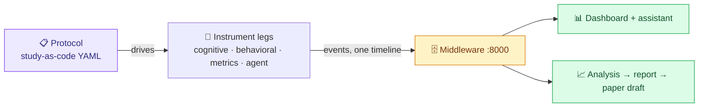

# Project Guide - Framework for Conducting Human-AI Studies

The umbrella guide for humans working on this repository: what the system
is, how it fits together, how to develop each part, and how a study actually
runs on it. Component-level depth lives in each directory (notably
`extension/PROJECT_GUIDE.md`); requirements and decisions live in
`requirements/`; the build plan lives in `roadmap/`.

---

## 1. What this is

A Masters project in **requirements engineering** that builds a
production-grade framework for conducting human-AI developer studies. Its
central idea: **a study protocol is a requirements specification**
("study-as-code"). One validated YAML file declares the study - research
questions, conditions, participants, instruments, lifecycle gates, analysis
plan - and the framework derives everything else: instrument configuration,
phase tracking, data validation, task management, analysis, and the paper
draft. The full argument: `roadmap/00-VISION.md`. The requirements it is
built against: `requirements/srs.md` (~68 requirements, MoSCoW-prioritized).

The first (and in-scope only) study family: how developers work with and
without AI assistance - including our own pilot study, which doubles as the
framework's evaluation.

## 2. Architecture in one pass



Four **instrument legs** capture one session from four angles, all stamped
with the same join keys (`participantId`, `condition`, `sessionId`,
timestamp, schema version) so everything joins on one timeline:

| Leg | What it captures | Where | Status |
| --- | ---------------- | ----- | ------ |
| Cognitive / self-report | fatigue probes, stuck episodes, TLX debrief - glass-style in-editor prompts | `extension/` | ✅ built |
| Behavioral | tab/file switches, edit bursts with origin (human/AI/paste), scroll/visible ranges, clipboard shapes, AI-completion review latency, active/idle | `extension/` (MP-05) | ✅ built |
| Static code metrics | 9-metric cognitive-load matrix over shadow-git workspace snapshots + task acceptance tests | `metrics/`, `agent-capture/` (MP-03/12) | ✅ built |
| Agent interaction | conversation turns, tool calls, reliance loops - Claude Code hooks live + transcript import backstop, consent-matched content policy | `agent-capture/` (MP-12) | ✅ built |

The **middleware** (`middleware/`, FastAPI on :8000) ingests all legs
idempotently, detects sequence gaps, stores artifacts, and serves the joined
one-timeline dataset. The **dashboard** (`dashboard/`, Svelte) is the
"dynamic project manager": lifecycle board, auto-derived task cards, live
sessions, swimlane timeline, metrics comparison, literature graph, and a
grounded Claude assistant. **Analysis** (`analysis/`) runs pluggable recipes
per the protocol's analysis plan and emits a per-RQ report, then a
Markdown/LaTeX paper draft. The **protocol** package (`protocol/`) owns the
schema, validation, lifecycle state machine, and config derivation.

## 3. Getting started

Prerequisites: **Python 3.12 + [uv](https://docs.astral.sh/uv/)**,
**Node ≥ 22**, VS Code ≥ 1.85. Docker only for the optional SonarQube
profile and (from MP-04) the composed production stack.

```bash
# Python side - one workspace venv at the repo root
uv sync --all-packages
uv run pytest                     # all Python tests
uv run python metrics/src/parsers/ts_parser.py    # metrics demo

# Extension side
cd extension && npm install && npm run check      # the extension gate
# F5 in VS Code opens the Extension Development Host; click "Study: idle"

# Dashboard side
cd dashboard && npm install && npm run check      # the dashboard gate

# Git hooks - the CI gate at commit time (.pre-commit-config.yaml)
uv run pre-commit install
```

To *run* the stack (middleware, dashboard, all four legs, analysis → paper →
retrospective), follow [`RUNBOOK.md`](RUNBOOK.md) - every command there is
verified end to end.

## 4. Directory guide

```
.
├─ PROJECT_GUIDE.md     This file
├─ RUNBOOK.md           How to run every component + end-to-end walkthroughs
├─ pyproject.toml       uv workspace root (members, ruff, pytest config)
├─ requirements/        THE RE FOUNDATION - read before changing anything
│  ├─ srs.md              all requirements (stable IDs, MoSCoW)
│  ├─ traceability.md     RQ → REQ → component → phase matrix (living)
│  ├─ build-vs-adopt.md   D1…: every reuse decision with rationale
│  ├─ stakeholders.md / research-questions.md / glossary.md
├─ roadmap/             00-VISION + mega-prompts 01–12 (the build plan)
├─ extension/           VS Code extension "Cognitive Overlay" (TS)
│  ├─ src/core/           IDE-agnostic science: heuristics, schemas, clocks
│  ├─ src/vscode/         VS Code adapter: prompts, sensors, sinks
│  ├─ docs/               Elicitation source + MP-05 adaptation notes
│  └─ PROJECT_GUIDE.md    Deep extension guide (architecture, porting)
├─ metrics/             Static-metrics scripts (flat src/)
│  └─ docs/               Elicitation source: 9-metric matrix + impl. plan
├─ protocol/            Study-as-code package (MP-02/09)   [built ✅]
├─ middleware/          Ingestion + query hub :8000 (MP-04/06/09/10/11) [built ✅]
├─ analysis/            Recipes → report → paper → retrospective (MP-07/09/11) [built ✅]
├─ agent-capture/       Agent leg + snapshots + harness (MP-12) [built ✅]
├─ dashboard/           Svelte 5 SPA - mission control (MP-06/10) [built ✅]
├─ study/pilot/         Study kit: runbook, consent, ethics, tasks, dry run (MP-08)
└─ scripts/             smoke.sh - one-command full-stack verification (NFR-9)
```

## 5. How work proceeds (the mega-prompt protocol)

1. Pick the next phase from the sprint table in `roadmap/00-VISION.md`.
2. Open `roadmap/NN-*.md`; it is self-contained: context, the requirement
   IDs it satisfies, deliverables, acceptance criteria, verification.
3. Build exactly that; run its verification steps.
4. Flip the phase row in the vision tracker and the requirement rows in
   `requirements/traceability.md` (a phase without flipped rows is not
   done), appending to the phase-completion log.

Changing requirements themselves: edit `requirements/srs.md` under the rules
at the top of `requirements/README.md` (stable IDs, supersession, glossary
first, decisions for new dependencies in `build-vs-adopt.md`).

## 6. How a study runs (facilitator story)

The lifecycle is a gated state machine - each transition is a
requirements-validation checkpoint (artifacts present, or no entry):

```mermaid
stateDiagram-v2
    direction LR
    dc: data-collection
    wu: write-up
    [*] --> design
    design --> ethics: protocol validated + tasks defined
    ethics --> pilot: ethics approval + consent form
    pilot --> recruitment: dry-run report
    recruitment --> dc: participant schedule
    dc --> analysis: dataset export + integrity report
    analysis --> wu: per-RQ report
    wu --> [*]
```



1. **Design** - write the protocol YAML (start from
   `protocol/examples/pilot-study.yaml`); attach literature; the dashboard's
   task board shows what the protocol still lacks.
2. **Ethics gate** - upload approval + consent artifacts; `data-collection`
   is literally unreachable without them (FR-ETH-1).
3. **Session day** - `docker compose up` (middleware + dashboard);
   `protocol derive overlay-settings` + `derive agent-hooks` configure the
   instruments (no hand configuration - that's the point); participant works
   in VS Code, optionally with Claude Code in the terminal; the dashboard
   shows the session live; local JSONL is the source of truth throughout.
4. **After each session** - transcript import reconciles agent events;
   snapshots + task harness recorded outcome ground truth; gap report checked.
5. **Analysis** - `analysis run <protocol> --study <id>` executes the
   protocol's analysis plan → per-RQ report; `analysis paper` emits the
   Markdown/LaTeX draft; the retrospective proposes framework improvements
   (human-approved).

## 7. Production posture (NFR-9)

From MP-04 onward the stack ships as `docker-compose.yml` at the root:
`middleware` (serving the built dashboard), optional `--profile sonar`
SonarQube, and a `demo-seed` service that replays a sample study so every
view renders with zero live participants. `scripts/smoke.sh` (MP-08)
exercises bring-up → ingest → dataset → report → paper draft and fails
loudly. "Inches from deployment" means: clean checkout + one command +
green smoke test.

## 8. Non-negotiables

The system invariants below are non-negotiable for every contributor - join
keys on every row, schema-version bumps, never interrupt the participant,
privacy by construction, participant data never in git. When in doubt, the
SRS is the arbiter; when the SRS is wrong, change the SRS first.
