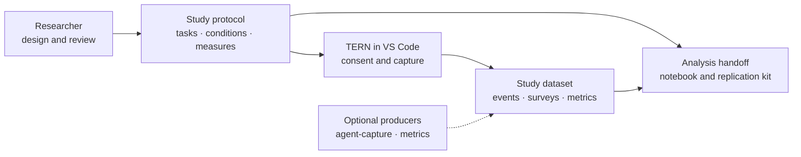

# PHOENIX and TERN

Tools for studying how developers work with AI.

A developer study often requires a protocol, participant assignments, editor
instrumentation, and analysis scripts assembled separately. Those pieces can
disagree: a planned measure may never be recorded, or the dataset may lack the
identifiers needed to compare conditions.

PHOENIX connects them through a versioned YAML protocol. Researchers review the
design in a web workspace; TERN runs the configured session in VS Code; the
server joins editor events, surveys, and optional external measurements for
export to a notebook. The live workflow is the supported product; external
data mining is kept as a separate experimental package.

This is a feature-complete master's research project for task-based human–AI
software-development studies. Future changes are refinements to correctness,
security, accessibility, reproducibility, and documentation; researchers remain
responsible for methodological choices, ethics approval, and interpretation.

## How it fits together



Start from a template or describe a question to the design assistant. Review the
proposals, compile the accepted decisions, and approve the protocol. Rehearse
with synthetic data, then issue participant links and collect the real sessions.

The design conversation can use Mistral for suggestions. Templates, validation,
assignment, capture, and exports work without a model key. Local corpus search
also works without a key; model-assisted matching and external paper lookup are
optional.

## Run locally

You need Python 3.12+, [uv](https://docs.astral.sh/uv/), and Node.js 22+.
From the repository root:

```bash
uv sync --all-packages --frozen
npm --prefix platform ci
npm --prefix platform run build
uv run python -m middleware serve
```

Open <http://localhost:8000>. Storage defaults to
`.study-data/middleware.sqlite3`; no database service is required. The paper
index imports in the background on the default database. To load it explicitly,
run `uv run python -m middleware corpus-import`.

For the design conversation, copy [.env.example](.env.example) to `.env`, set
`MISTRAL_API_KEY`, and start the server with:

```bash
uv run --env-file .env python -m middleware serve
```

The CLI does not automatically load `.env`. The design model defaults to
`mistral-medium-latest`; `MISTRAL_DESIGN_MODEL` overrides it.

For frontend development, keep the middleware running and use
`npm --prefix platform run dev`. Vite proxies API requests to port 8000.
Workspace changes require the server; connection failures report an error.

Alternatively, `docker compose up --build` starts the app, PostgreSQL, and a
synthetic demo. See [server configuration](middleware/README.md).

## Run a participant session

Install TERN from the repository's
[releases](https://github.com/idreesshaikh/human-ai-studies-framework/releases)
using **Extensions: Install from VSIX…**, or follow the
[extension development guide](extension/docs/development.md).

In an approved study, open **Run → Enrollment** and create a participant link. Open
the link on the participant's machine, review consent, and start a TERN session.
The [rehearsal guide](docs/demo-runbook.md) covers the complete flow.

TERN records measurements such as edit sizes, focus changes, fatigue responses,
and suggestion timing. Optional transcript and snapshot tools have separate
content policies; review [agent capture](agent-capture/README.md) before enabling
them. Never commit participant data, credentials, or local databases.

## Analysis and export

Use the protocol exported from your study and its dataset:

```bash
uv run analysis list
uv run analysis validate study.yaml --dataset dataset.json
uv run analysis notebook study.yaml --dataset dataset.json
uv run analysis run study.yaml --dataset dataset.json
```

Omit `--dataset` to fetch from the local server, or use `--server URL`.
Set `MIDDLEWARE_TOKEN` when the server requires a bearer token. Generated files
go under `results/`. The notebook includes the data and imports the planned
recipes; it does not execute them automatically.

Dry runs persist labelled synthetic rows in the selected study. Use a separate
rehearsal study and keep those rows out of participant analyses. Each dry-run
report uses only the sessions created by that run. Passing it checks that the
capture and analysis paths connect, not that the study design is valid.

## Contribute

Start with [contributing](docs/contributing.md) for setup and checks, and the
[architecture guide](docs/architecture.md) for the code paths. The
[scope](docs/scope.md) explains the project boundary. Bug reports, reproducibility
improvements, documentation, and research-method contributions are welcome.

| Directory | Responsibility |
| --- | --- |
| `platform/` | Researcher web workspace |
| `middleware/` | API, storage, design conversation, literature retrieval |
| `protocol/` | Schema, validation, assignment, capture configuration, replication kits |
| `extension/` | TERN participant interface and editor capture |
| `analysis/` | Datasets, analysis recipes, notebooks and reports |
| `agent-capture/` | Optional provider transcripts, snapshots, and task harness |
| `metrics/` | Optional static code measurements |
| `curated/` | Experimental local-archive mining contracts (not part of the live path) |
| `templates/` | Study designs with references and analysis plans |

The repository also carries research inputs and reproducible fixtures: the paper
index, notebooks, sample events, and lockfile are data or documentation, not
application modules. Keep them versioned, but do not mistake their line count
for live code.

Report sensitive issues through the [security policy](docs/security.md).
Released under the [MIT License](LICENSE).
