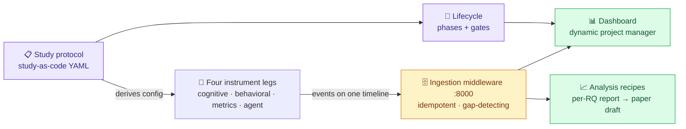

# Framework for Conducting Human-AI Studies

[](https://github.com/ole1711/Masters-Project/actions/workflows/ci.yml)

A requirements-engineered, production-oriented framework that takes a
human-AI study from research question to publishable paper on one platform -
protocol-driven instruments, a dashboard that acts as the study's dynamic
project manager, literature intelligence (paper graph + grounded Claude
assistant), and traceable analysis. First study family: how developers work
with (and without) AI assistance.

It instruments a study session from **four angles that share one timeline** -
every data point carries a timestamp, participant ID, condition, session ID,
and schema version, so the streams join cleanly in analysis:

1. **Cognitive / self-report** - in-IDE fatigue sampling, stuck-moment
   detection, and end-of-study debrief, rendered as glass-style in-editor
   surfaces (`extension/`).
2. **Behavioral telemetry** - tab switches, edit provenance (human/AI/paste),
   scroll coverage, AI-completion review latency, clipboard activity
   (`extension/`).
3. **Static code metrics** - the 9-metric cognitive-load matrix over
   snapshots of the participant's code, plus task acceptance tests for
   outcome ground truth (`metrics/`).
4. **Agent interaction** - the AI's side of the session: conversation turns,
   tool calls, and reliance loops, captured via Claude Code hooks +
   transcript import under a consent-matched content policy
   (`agent-capture/`).

All four legs are built, as are the middleware, dashboard, analysis
pipeline, paper export, and retrospective; the pilot study itself awaits
its ethics gate (see the tracker in `roadmap/00-VISION.md`).

The project is run as a requirements engineering exercise: the platform is
built against a real SRS, and its central claim is that a study protocol *is*
a machine-readable requirements specification ("study-as-code").



## Start here

| You want to… | Read |
| ------------ | ---- |
| **Understand the whole project in plain language** (what the IDs mean, the guided tour, 30-minute hands-on path) | [`TOUR.md`](TOUR.md) |
| **Run any part of the stack** (every component, end-to-end walkthroughs, troubleshooting) | [`RUNBOOK.md`](RUNBOOK.md) |
| Understand the vision, architecture, and sprint plan | [`roadmap/00-VISION.md`](roadmap/00-VISION.md) |
| Develop on the repo (setup, workflows, conventions) | [`PROJECT_GUIDE.md`](PROJECT_GUIDE.md) |
| See the requirements & traceability everything links to | [`requirements/`](requirements/README.md) |
| Run the ingestion service | [`middleware/README.md`](middleware/README.md) |
| Conduct a real study session (facilitator script) | [`study/pilot/runbook.md`](study/pilot/runbook.md) |

## Repository structure

```
.
├─ roadmap/          Vision + executable phase specs 01–12 (the build plan)
├─ requirements/     RE foundation: SRS, traceability, build-vs-adopt decisions
├─ extension/        VS Code extension "Cognitive Overlay" (cognitive + behavioral legs)
├─ metrics/          Static-metrics leg (Python, tree-sitter/Radon/SonarQube)
├─ protocol/         Study-as-code schema + lifecycle + CLI (Python)
├─ middleware/       Ingestion service on :8000 (FastAPI + SQLite)
├─ analysis/         Recipes → per-RQ report → paper draft → retrospective
├─ agent-capture/    Agent leg: hooks, transcript import, snapshots, task harness
├─ dashboard/        Dynamic-project-manager UI (Svelte 5 + Vite)
├─ study/pilot/      Study kit: facilitator runbook, consent, ethics, tasks, dry run
├─ scripts/          smoke.sh - one-command full-stack verification
├─ RUNBOOK.md        How to run everything (start here to operate the stack)
└─ docker-compose.yml  One-command bring-up with a seeded demo session
```

## Quick start

Prerequisites: Python 3.12 + [uv](https://docs.astral.sh/uv/), Node ≥ 22,
Docker (optional, for the composed stack).

```bash
# Install everything (one venv at the repo root)
uv sync --all-packages

# Tests + lint (the same gate CI runs)
uv run pytest
uv run ruff check .
```

### Run the pieces

```bash
# Validate a study protocol and derive instrument settings from it
uv run protocol validate protocol/examples/pilot-study.yaml
uv run protocol status   protocol/examples/pilot-study.yaml
uv run protocol derive overlay-settings protocol/examples/pilot-study.yaml \
    --participant P01 --condition ai-assisted

# Extract the 9-metric cognitive-load matrix over a directory of Python code
uv run python metrics/src/main.py --participant P01 --condition unassisted
uv run python metrics/src/main.py --format jsonl        # middleware-ready rows

# Start the ingestion middleware on :8000 and seed it with the demo session
MIDDLEWARE_PROTOCOL=protocol/examples/pilot-study.yaml uv run python -m middleware
uv run python middleware/scripts/replay_session.py      # in a second terminal

# Analyze: per-RQ report → paper draft → self-improvement retrospective
uv run analysis run   protocol/examples/pilot-study.yaml --out results
uv run analysis paper protocol/examples/pilot-study.yaml --out results
uv run analysis retrospective protocol/examples/pilot-study.yaml --out retrospective

# Agent leg: hooks config from the protocol; transcript import as backstop
uv run protocol derive agent-hooks protocol/examples/pilot-study.yaml
uv run agent-capture import <transcript.jsonl> --participant P1 \
    --condition ai-assisted --session S1
```

Every command above (and the dashboard, extension, SonarQube profile, study
lifecycle, replication kit, …) is covered step by step in
[`RUNBOOK.md`](RUNBOOK.md).

### One-command stack (Docker)

```bash
docker compose up                  # middleware on :8000, seeded with a demo session
docker compose --profile sonar up  # …plus SonarQube for cognitive complexity
```

### VS Code extension

```bash
cd extension && npm install && npm run check
# then F5 in VS Code → Extension Development Host → click "Study: idle"
```

## Continuous integration

Every push runs the full gate (`.github/workflows/ci.yml`): Python tests
(with a coverage gate on the metrics leg) + ruff across the uv workspace,
the extension's typecheck/lint/format/test suite, the dashboard's
svelte-check + vitest suite, and a build of the middleware Docker image.

## License

MIT - see [LICENSE](LICENSE).
