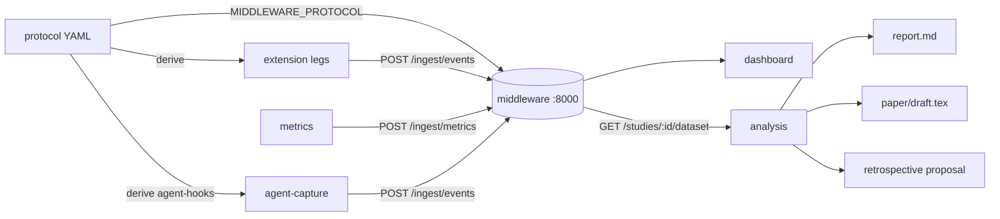

# Runbook - operating the framework end to end

This is the operator's guide to every runnable piece of the platform: what
each component is, how to start it, how the pieces talk to each other, and
the full walkthroughs from "clean checkout" to "compiled paper draft".
For the vision and architecture, read [`roadmap/00-VISION.md`](roadmap/00-VISION.md);
for developing *on* the repo, read [`PROJECT_GUIDE.md`](PROJECT_GUIDE.md);
for conducting a real study session with a participant, the facilitator's
script is [`study/pilot/runbook.md`](study/pilot/runbook.md).

Everything below was executed and verified on a clean checkout.

---

## 0. The map

| Component | What it is | Run it | Gate |
| --------- | ---------- | ------ | ---- |
| `protocol/` | Study-as-code: validate protocols, drive the lifecycle, derive instrument configs, export replication kits | `uv run protocol …` | `uv run pytest protocol` |
| `middleware/` | The hub: ingestion + storage + query API on **port 8000** (every sensor assumes it - FR-ING-1) | `uv run python -m middleware` | `uv run pytest middleware` |
| `dashboard/` | Mission control SPA (Svelte 5): task board, lifecycle, live timeline, metrics, knowledge graph | `npm run dev` (dev) / built `dist/` served by the middleware (prod) | `npm run check` in `dashboard/` |
| `extension/` | "Cognitive Overlay" VS Code extension: cognitive + behavioral legs | F5 in VS Code → Extension Development Host | `npm run check` in `extension/` |
| `metrics/` | Static-metrics leg: the 9-metric cognitive-load matrix over a code directory | `uv run python metrics/src/main.py …` | `uv run pytest metrics` |
| `agent-capture/` | Agent leg: Claude Code hooks, transcript import, workspace snapshots, task harness, correlation | `uv run agent-capture …` | `uv run pytest agent-capture` |
| `analysis/` | Recipes → per-RQ report → paper draft → retrospective | `uv run analysis …` | `uv run pytest analysis` |

Data flow in one sentence: the **protocol** configures the four instrument
legs (extension x2, metrics, agent-capture), all legs POST to the
**middleware** on `:8000` on one shared timeline, the **dashboard** projects
that state live, and **analysis** pulls the joined dataset back out to
produce the report, the paper draft, and the retrospective.



---

## 1. Prerequisites & one-time setup

| Tool | Version | Needed for |
| ---- | ------- | ---------- |
| Python + [uv](https://docs.astral.sh/uv/) | 3.12, uv ≥ 0.5 | everything Python (uv manages the venv - never pip/venv by hand) |
| Node.js | ≥ 22 | `extension/` and `dashboard/` |
| Docker | any recent | optional: the one-command composed stack + SonarQube |
| [tectonic](https://tectonic-typesetting.github.io/) *or* `pdflatex` | any | optional: compiling the generated paper draft to PDF (`brew install tectonic`) |

```bash
# 1. Python workspace - one venv at the repo root, all packages
uv sync --all-packages

# 2. Node components
(cd extension && npm install)
(cd dashboard && npm install)

# 3. Optional: commit-time gate mirroring CI
uv run pre-commit install

# 4. Prove the checkout is healthy (same gates CI runs)
uv run pytest && uv run ruff check .
(cd extension && npm run check)
(cd dashboard && npm run check)
```

---

## 2. Fastest demo: the composed stack

One command brings up the middleware with the pilot protocol loaded, serves
the dashboard at the same address, and seeds a demo session so every view
has data:

```bash
docker compose up          # middleware :8000 + demo seed
# then open http://127.0.0.1:8000  ← the dashboard
docker compose --profile sonar up   # …plus SonarQube on :9000 (cognitive-complexity metric)
```

Verify the whole chain in one shot (health → dashboard → idempotent ingest →
gap detection → dataset export → per-RQ report → paper draft):

```bash
bash scripts/smoke.sh                   # brings the stack up itself
SMOKE_NO_COMPOSE=1 bash scripts/smoke.sh    # against an already-running stack
```

To reset the demo data (**required before collecting real data** - dry-run
finding DR-05): `docker compose down -v` (drops the `study-data` volume).

---

## 3. The local (no-Docker) stack

### 3.1 Middleware - the hub on :8000

```bash
# Plain (accept-all ingest):
uv run python -m middleware

# Protocol-aware (recommended): validates conditions/participants, flags
# off-protocol rows instead of dropping them (FR-ING-6):
MIDDLEWARE_PROTOCOL=protocol/examples/pilot-study.yaml uv run python -m middleware
```

All configuration is environment variables (defaults in
`middleware/src/middleware/settings.py`):

| Env var | Default | Meaning |
| ------- | ------- | ------- |
| `MIDDLEWARE_PORT` | `8000` | the port every sensor assumes; change only if you also change every leg's endpoint |
| `MIDDLEWARE_DB` | `.study-data/middleware.sqlite3` | SQLite file (gitignored - participant data never enters git) |
| `MIDDLEWARE_DATA_DIR` | `.study-data` | artifact/file store root |
| `MIDDLEWARE_PROTOCOL` | *(unset)* | study protocol YAML; unset = accept-all ingest |
| `MIDDLEWARE_DASHBOARD` | `dashboard/dist` | built SPA to serve at `/`; missing dir = API-only |
| `MIDDLEWARE_TOKEN` | *(unset)* | optional bearer token for query/task endpoints; **ingest is deliberately never authenticated** (NFR-1: sensors are fire-and-forget) |
| `MIDDLEWARE_ZOTERO_LOCAL_URL` | `http://127.0.0.1:23119` | Zotero desktop app's local API |
| `MIDDLEWARE_ZOTERO_USER_ID` / `MIDDLEWARE_ZOTERO_API_KEY` | *(unset)* | hosted-Zotero fallback credentials |
| `ANTHROPIC_API_KEY` | *(unset)* | enables the knowledge assistant (`POST /studies/{id}/assistant`); unset = graceful 503, everything else works offline |

Seed it with the demo session (idempotent - run it twice, no duplicates):

```bash
uv run python middleware/scripts/replay_session.py            # → :8000
uv run python middleware/scripts/replay_session.py --server http://127.0.0.1:8000
```

The API surface at a glance (see `middleware/README.md` for details):

| Endpoint | What |
| -------- | ---- |
| `GET /health` | liveness + loaded study id |
| `POST /ingest/events` · `POST /ingest/metrics` | the two ingest paths, idempotent per `(sessionId, source, seq)` / content hash |
| `GET /sessions/{id}/gaps` | seq-gap integrity report (NFR-2: loss is detectable) |
| `GET /studies/{id}/dataset?format=json\|csv` | the joined one-timeline export all analysis consumes |
| `GET /studies/{id}/status` · `/lifecycle` · `/live` · `/protocol` | dashboard projections |
| `POST /files` + gate artifact uploads | lifecycle gates (FR-PROT-3) |
| `GET/POST /findings` · `POST /studies/{id}/findings/scan` | operational findings log (FR-META-1) |
| `GET/POST /tasks` | manual task-board cards |
| `POST /studies/{id}/papers` · `/papers/upload` · `/papers/zotero-import` · `GET /papers/graph` | knowledge layer (MP-10) |
| `POST /studies/{id}/assistant` | grounded Claude assistant (aggregates only - FR-ETH-4) |

### 3.2 Dashboard

**Dev** (hot reload; API calls proxy to the middleware on :8000 - start the
middleware first):

```bash
cd dashboard && npm run dev     # http://localhost:5173
```

**Prod** (one process serves the whole stack - NFR-7):

```bash
cd dashboard && npm run build   # → dashboard/dist
# restart the middleware; it serves dist/ at http://127.0.0.1:8000/
```

Routes: `/study/pilot-2026/overview | board | tasks | live | sessions/:sid |
metrics | knowledge`.

### 3.3 VS Code extension (cognitive + behavioral legs)

```bash
cd extension && npm install && npm run compile
```

Open `extension/` in VS Code, press **F5** → Extension Development Host. In
that window click **`Study: idle`** in the status bar, enter the participant
ID and condition, and work. Events land in
`<workspace>/.study-data/<participant>_<timestamp>.jsonl` (the source of
truth) and mirror to `http://127.0.0.1:8000/ingest/events` best-effort.

Derive the exact per-session settings from the protocol instead of
hand-configuring (probe intervals, thresholds, endpoint):

```bash
uv run protocol derive overlay-settings protocol/examples/pilot-study.yaml \
    --participant P1 --condition ai-assisted
# → paste the JSON into the task workspace's .vscode/settings.json
```

### 3.4 Static metrics leg

```bash
# Analyze a directory of Python code (default: the specimen corpus)
uv run python metrics/src/main.py <target-dir> \
    --participant P1 --condition ai-assisted --session S1 \
    --format jsonl --out /tmp/metrics.jsonl
# CSV for eyeballing:
uv run python metrics/src/main.py --format csv

# Cognitive complexity needs SonarQube (optional):
docker compose --profile sonar up
uv run python metrics/src/main.py --sonar-url http://127.0.0.1:9000
```

JSONL rows are middleware-ready: POST them to `/ingest/metrics` (the
facilitator runbook and smoke script show the exact call).

### 3.5 Agent leg (`agent-capture`)

Join keys come from flags or the `STUDY_*` env vars the facilitator runbook
exports: `STUDY_PARTICIPANT`, `STUDY_CONDITION`, `STUDY_SESSION`,
`STUDY_INGEST_ENDPOINT`, `STUDY_CONTENT_POLICY`.

```bash
# 1. Live capture - install the Claude Code hooks with the content policy
#    baked from the protocol (never hand-edit the policy):
uv run protocol derive agent-hooks protocol/examples/pilot-study.yaml
# → merge the emitted JSON into the task workspace's .claude/settings.json

# 2. Post-session backstop - import the finished transcript (idempotent
#    with anything the live hook already sent; NFR-2 recovery path):
uv run agent-capture import <transcript.jsonl> \
    --participant P1 --condition ai-assisted --session S1

# 3. Workspace snapshots (shadow git - D14) + participant-commit observation:
uv run agent-capture snapshot --workspace <task-dir> \
    --git-dir .study-data/shadow.git --trigger save

# 4. Task outcome - run the task's acceptance tests, emit task_outcome:
uv run agent-capture harness --help    # per-task config

# 5. After ingest: cross-leg correlation + code-evolution series
#    (reliance loops, edit-burst ↔ agent-turn links; derived, never raw):
uv run agent-capture correlate --help
```

Content policy (FR-AGENT-5): `metadata-only` (pilot default - zero
conversation text stored) / `redacted` / `full`. It is declared in the
protocol and matched to the consent form; the redaction choke point is
`agent-capture/src/agent_capture/redact.py`.

### 3.6 Protocol lifecycle

```bash
uv run protocol validate protocol/examples/pilot-study.yaml   # schema + semantics
uv run protocol status   protocol/examples/pilot-study.yaml   # phase + missing gates
```

The lifecycle is gate-driven (design → ethics → pilot → recruitment →
data-collection → analysis → write-up): a phase advances only when its gate
artifacts are uploaded to the middleware (`POST /files` or the dashboard's
lifecycle board). A satisfied later-phase gate never leapfrogs an earlier
blocked one (FR-ETH-1: no ingest-dependent phase before ethics clears).

---

## 4. Analysis: from data to paper

All analysis commands take the protocol as their first argument and fetch
the dataset from the middleware, or run fully offline from an exported file
(`--dataset export.json`).

```bash
# 0. What recipes exist, and what does each require?
uv run analysis list

# 1. Pre-flight (FR-ANA-2): can the plan run on the data we actually have?
#    Names every missing event type / metric column BEFORE anything runs.
uv run analysis validate protocol/examples/pilot-study.yaml

# 2. The per-RQ report (exact tests, effect sizes, per-cell n - NFR-8):
uv run analysis run protocol/examples/pilot-study.yaml --out results
# → results/pilot-2026/report.md (+ figures). Exit 2 = report written but
#   some recipes failed validation - loud by design, scripts must notice.

# 3. The paper draft (FR-ANA-6) - deterministic, no LLM in the pipeline:
uv run analysis paper protocol/examples/pilot-study.yaml --out results
# → results/pilot-2026/paper/{draft.md, draft.tex, references.bib, figures/}
cd results/pilot-2026/paper && tectonic draft.tex          # → draft.pdf
# (or: pdflatex draft && bibtex draft && pdflatex draft)

# 4. The retrospective (FR-META-2) - the framework proposes its own fixes:
uv run analysis retrospective protocol/examples/pilot-study.yaml \
    --findings-md study/pilot/findings.md --out retrospective
# With ANTHROPIC_API_KEY: Claude drafts the changelist proposal (findings +
# aggregates only - FR-ETH-4). Without: you get the assembled evidence
# bundle + a template to draft by hand. Either way the proposal is INERT -
# a human applies accepted items as ordinary change-managed SRS edits.

# 5. The replication kit (FR-PROT-7, NFR-6) - byte-stable tar.gz:
uv run protocol export replication-kit protocol/examples/pilot-study.yaml \
    --out replication-kit.tar.gz
# A fresh checkout + this kit regenerates report.md byte-for-byte.
```

---

## 5. Running a real study session

The complete facilitator script - setup checklist, Latin-square
counterbalancing, per-session steps, incident playbook - is
[`study/pilot/runbook.md`](study/pilot/runbook.md). The shape of a session:

1. **Pre-study (once):** ethics gate cleared (consent forms uploaded),
   demo data reset (DR-05), one interactive dev-host pass (DR-06).
2. **Per session:** export the `STUDY_*` env vars → derive + apply
   `overlay-settings` and (AI condition) `agent-hooks` → start the
   middleware → participant works the task in the Extension Development
   Host → harness runs acceptance tests on save → snapshot ticks.
3. **Post-session:** `agent-capture import` the transcript (backstop),
   run the metrics orchestrator over the final workspace, check
   `GET /sessions/{id}/gaps` for losses, `agent-capture correlate`.
4. **After the study:** `analysis run` → `analysis paper` →
   `analysis retrospective` → `protocol export replication-kit`.

---

## 6. Tests, lint, and the CI mapping

| Local command | CI job |
| ------------- | ------ |
| `uv run pytest --cov=metrics/src --cov-report=term-missing --cov-fail-under=95` | Python - pytest + ruff (coverage gate on the metrics leg) |
| `uv run ruff check .` | Python - pytest + ruff |
| `cd extension && npm run check` | Extension - typecheck + lint + format + test |
| `cd dashboard && npm run check` | Dashboard - svelte-check + vitest |
| `docker build -f middleware/Dockerfile .` | Middleware image builds |

`uv run pre-commit install` mirrors the same gate at commit time. Two
directories are excluded from formatting fixers on purpose: `metrics/corpus/`
(byte-exact metric specimens) and `analysis/tests/fixtures/` (byte-exact
golden paper drafts).

---

## 7. Troubleshooting

| Symptom | Cause / fix |
| ------- | ----------- |
| Sensor events aren't arriving | Middleware not on :8000, or wrong endpoint in the derived settings. Sensors never crash on this (NFR-1) - they buffer to local JSONL; check `GET /health`, then re-import/replay. Loss is visible in `GET /sessions/{id}/gaps`. |
| `analysis run` exits 2 | Not an error in itself: the report was written but some plan entries failed their requires-check (each failure names the missing event type/metric). `agent_turn`/`task_outcome` failures on the demo seed are expected until agent-leg data exists. |
| Dashboard 404 / API-only responses at `/` | `dashboard/dist` doesn't exist - run `npm run build` in `dashboard/`, or use `npm run dev` on :5173. |
| `POST /studies/{id}/assistant` → 503 | No `ANTHROPIC_API_KEY`. Everything else is unaffected (NFR-7 offline posture). |
| Paper compiles with overfull-hbox warnings | Cosmetic (wide result tables). No TeX engine at all? `brew install tectonic` - or skip compilation; `draft.md` carries the same content. |
| Cognitive-complexity column empty | SonarQube not running: `docker compose --profile sonar up`, pass `--sonar-url`. The other 8 metrics degrade gracefully (never block). |
| Rows flagged `unknown-participant` / `unknown-condition` | Ingest is protocol-aware and the row's join keys aren't in the plan. Rows are stored + flagged, never dropped (FR-ING-6); fix the session config or amend the protocol. |
| Middleware refuses to start: "database … predates the current schema" | The SQLite file (often the compose `study-data` volume) was created by an older middleware version and the table shape has since changed. Nothing is migrated automatically - if the data is disposable demo seed, reset it (`docker compose down -v`, or delete the file locally); if it's real study data, point `MIDDLEWARE_DB` at a fresh file and migrate the old one deliberately. |
| Stale demo data before a real study | `docker compose down -v`, or delete `.study-data/` locally (DR-05 - it's gitignored). |

---

## 8. Data-safety invariants (non-negotiable)

- **Participant data never enters git:** `.study-data/`, `*.sqlite3`,
  `results/`, `shadow.git/` are gitignored. Keep it that way.
- **No raw content in instruments:** aggregates, shapes, salted hashes only;
  the two scoped exceptions (agent-conversation content, workspace
  snapshots) are governed by the protocol's consent-matched content policy.
- **The knowledge assistant sees aggregates only** (FR-ETH-4) - enforced
  server-side; it has no tool that can return a participant row.
- **Never interrupt the participant:** every sensor failure is swallowed,
  counted, and reported once - loss is detectable via `seq` gaps, sessions
  are never blocked.
