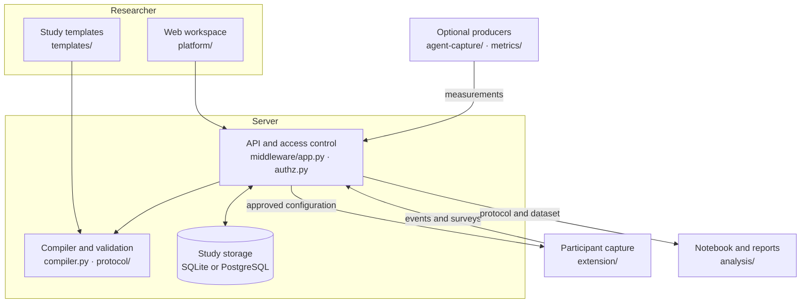
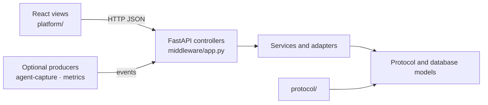
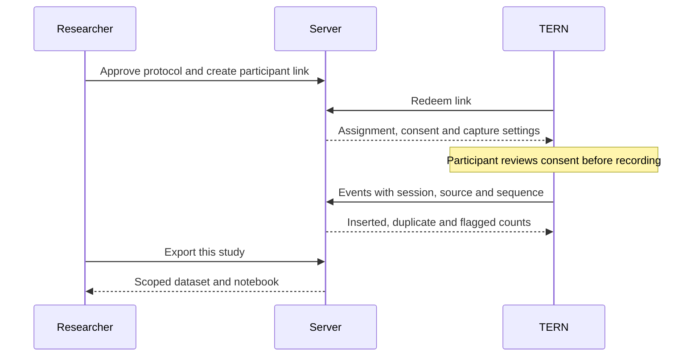

# Architecture

The protocol connects the researcher's intended study to capture and analysis.
The web app helps build it; the remaining tools consume it.

The supported product is a live, protocol-driven study. Optional producers
send measurements to the same ingest contract, while `curated/` is an isolated
external-data experiment outside the release path.

Python packages use a `src/` layout. For example, `middleware/app.py` below
means [middleware/src/middleware/app.py](../middleware/src/middleware/app.py).

## Design

### Boundaries

The code follows a small MVC-style split rather than a framework-specific
layering rule:

- **Models** are the protocol objects in `protocol/`, SQLAlchemy persistence
  models in `middleware/src/middleware/db.py`, and HTTP wire models in
  `middleware/src/middleware/schemas.py`.
- **Controllers** are the FastAPI endpoints in `middleware/src/middleware/app.py`.
  They authenticate requests, validate input, orchestrate a transaction, and
  shape the response. Some existing handlers still contain their small database
  transaction because `app.py` is the composition root; reusable domain rules
  belong in the service modules.
- **Views** are the React components in `platform/src/`; they consume API
  responses and do not own study or database rules.
- **Services and adapters** are the focused modules beside the controller:
  `compiler`, `enrollment`, `matching`, `template_registry`, `simulation`,
  `analysis`, `agent-capture`, and `metrics`.  They can be tested without a
  browser.

`app.py` remains the composition root for now, so its route groups are easy to
run and test together.  New work should extract a complete feature group into
an `APIRouter` only when the group has a clear service boundary; splitting a
function merely to reduce a line count would hide, rather than remove, coupling.

`platform/src/components/conversation/` renders turns, proposals, and the draft.
`middleware/design_assistant.py` combines study state and retrieved literature;
`design_llm.py` constrains and parses model output. `assistant.py` supplies the
Mistral transport. There is no separate knowledge-chat interface.

After researcher review, `middleware/compiler.py` folds accepted changes into
YAML and validates it through `protocol/loader.py`. The browser compiler in
`platform/src/lib/compiler.ts` provides a preview. The server is authoritative;
check both implementations when changing a move shape.

`template_registry.py` validates and instantiates designs from
`templates/registry/`. Candidates in `templates/drafts/` need human review.

## Capture and storage

`protocol/assignment.py` assigns task/condition blocks. `capture.py` and
`derive.py` produce the capture configuration and session manifest.
`middleware/enrollment.py` issues and redeems participant links.

`extension/src/core/` holds capture logic; `extension/src/vscode/` connects it
to the editor. Optional external tools consume the same session identity.
Each producer owns a sequence stream; `(sessionId, source, seq)` identifies
an event and makes replay idempotent.

`middleware/db.py` defines tables and schema upgrades. `ingest_core.py` inserts
events and metrics. `auth.py` resolves identity; `authz.py` checks membership.
`SessionOpen` and `SessionBlock` map sessions to studies. Per-study reads use
`_session_scope`; `_joined_rows` applies it before dataset, notebook, and
replication-kit export. Only a single-user boot-protocol study may adopt unmapped
legacy sessions.

TERN telemetry excludes source and clipboard text. External transcript policies
can allow content; workspace snapshots store source locally. The model receives
the design conversation and literature, not participant event rows.

## Analysis and rehearsal

`analysis/dataset.py` prepares the joined dataset. Recipes register required
events and metrics in `analysis/core.py`. `runner.py` checks the plan and writes
tables, figures, and reports. `notebook.py` supplies a notebook and dictionary;
`protocol/export.py` packages a reproducible replication kit.

`middleware/simulation.py` creates synthetic events and session blocks without
issuing participant credentials. Rows carry `payload.synthetic: true`; the
response lists `sessionIds`. Each dry-run report uses only that run's sessions.
Synthetic rows remain in the selected study, so use a separate rehearsal study
or filter them explicitly before participant analysis.

`curated/` is an experimental library for local archive import,
pseudonymisation, and validity-threat records. It is not imported by the live
server, does not provide a mining command or API adapter, and must not be
described as a finished observational-study workflow.

## Where maintenance is needed

The API is still concentrated in a large module. Extract routes by feature when
working on that feature, with access-control tests. Keep optional producers out
of the server's hard dependencies. Protocol `phases` remains for schema
compatibility; there is no phase-transition service.

The model and paper services are tested with fixtures. Tests do not establish
live-provider availability or methodological validity. See
[contributing](contributing.md) for reproducible checks.
