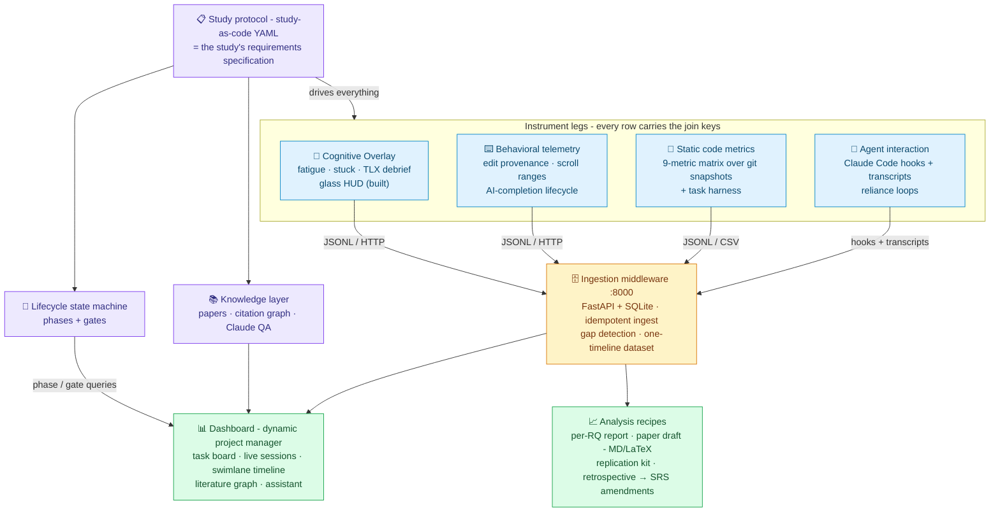
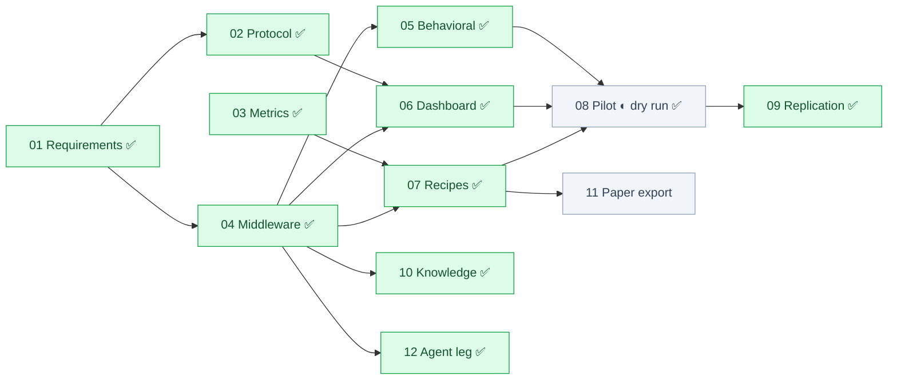

# Framework for Conducting Human-AI Studies

> **Superseded 2026-07-17 by the v2 platform vision — `docs/VISION.md`
> (MP-01 rev 8, traceability §3).** This document remains the intact record
> of the v1 sprint: its pillars, invariants, and the mega-prompt tracker
> below stay authoritative for MP-01..13. New work follows v2.

**The Masters Project.** One-line pitch: *a requirements-engineered,
production-ready framework that takes a human-AI study from research question
to publishable paper on one platform - protocol-driven instruments, live
dashboard, traceable analysis, literature intelligence.*

## The problem

Every empirical study in software engineering reinvents its own machinery:
pre-study design, ethics, instrumentation, data collection, statistical
analysis, write-up. The research *content* is unique; the research *process*
is not - yet it is rebuilt from scratch every time, inconsistently, with no
traceability from research question to final claim. Replication is nearly
impossible because the process was never specified, only performed.

## The thesis (requirements engineering is the big idea)

This project treats **conducting a study as a requirements engineering
exercise**, at two levels:

1. **RE *of* the framework** - the framework itself is built against a real
   SRS: stakeholder analysis, elicited and prioritized requirements, an
   adopt/adapt/build decision record, and a traceability matrix that every
   implementation phase links back to (`requirements/` - Mega-Prompt 01, done).

2. **RE *by* the framework** - the framework's core product is the insight
   that a **study protocol is a requirements specification**:

   | Requirements engineering        | Empirical study                          |
   | ------------------------------- | ---------------------------------------- |
   | Stakeholder goals               | Research questions                       |
   | Elicitation                     | Literature graph, pre-study, pilots      |
   | Specification (SRS)             | Study protocol (machine-readable YAML)   |
   | Implementation                  | Instruments (IDE extensions, metrics)    |
   | Verification & validation gates | Ethics approval, pilot, phase gates      |
   | Traceability                    | RQ → requirement → instrument → data field → analysis → claim → paper section |
   | Change management               | Protocol amendments, schema versioning   |
   | Process improvement             | Post-study retrospective feeds SRS amendments (self-improving) |

   "Study-as-code": a study is declared once in a validated protocol file,
   and the framework derives everything else - which instruments run, what
   data is expected, which phase you are in, what is still missing, which
   analyses answer which research question, and which paper sections the
   results fill.

## The six capability pillars

1. **Protocol & lifecycle** - study-as-code YAML + phase/gate state machine.
2. **Instruments** - four legs sharing one timeline, all VS Code-hosted or
   VS Code-adjacent, all protocol-configured. The full capture triangle the
   framework exists for: **the human** (cognition + behavior), **the
   agent** (its side of the conversation), **the code** (quality +
   correctness over time):
   - *Cognitive/self-report* (built): fatigue probes, stuck detection,
     TLX debrief - rendered as translucent in-editor glass surfaces, never
     a separate screen (FR-INST-13).
   - *Behavioral telemetry*: tab/file switching, visible-range (scroll)
     tracking, edit provenance (human-typed vs AI-injected vs pasted),
     clipboard events, **AI-completion lifecycle** (shown → reviewed →
     accepted/rejected, with review latency) - adapted from Tako,
     ActivityWatch, and WakaTime patterns (`extension/docs/developer_behavior_capture.md`).
   - *Static code metrics*: the 9-metric cognitive-load matrix
     (`metrics/docs/static_code_metrics.md`) - nesting penalty, cognitive
     complexity, parameter count vs Miller's Law, Halstead effort, scope
     distance, indentation variance, line-width bounds, identifier length,
     comment ratio - computed as a **time series** over shadow-git
     workspace snapshots, with per-task acceptance tests providing outcome
     ground truth (pass rates, time-to-first-green).
   - *Agent interaction* (the fourth leg): the AI's side of the session -
     conversation turns, tool calls, model/session metadata - captured
     live via **Claude Code hooks** with transcript-JSONL import as the
     completeness backstop (D13); correlated with editor events to detect
     reliance loops (error → agent → paste-back). Conversation content is
     governed by a protocol-declared, consent-matched policy
     (`metadata-only`/`redacted`/`full`).
3. **Middleware** - FastAPI ingestion on **port 8000** (the contract the
   behavior doc already assumes), one queryable store, integrity checks.
4. **Dashboard - the dynamic project manager** (supervisor's headline
   feature): not a passive chart page but the study's mission control -
   auto-computed task board (every missing gate artifact and pending action
   is a card), lifecycle kanban, live sessions, one-timeline swimlanes,
   condition comparisons, literature graph, and a Claude-powered assistant.
5. **Knowledge layer** - upload papers / arXiv / DOI, build a
   ResearchRabbit-style related-papers graph (Semantic Scholar citation
   API), link papers to the protocol elements they justify, and ask
   natural-language questions over papers + protocol + dataset (Claude API).
6. **Outputs** - recipe-based analysis with honest statistics, a per-RQ
   report, **one-command paper draft extraction** (methods from protocol,
   results from recipes), replication kits, and a post-study retrospective
   that proposes framework improvements (self-evolving, human-approved).

## Scope discipline

One study family (agent–human developer studies), one validation case (our
own with/without-AI pilot), generality by design not implementation.
Deferred and argued in the SRS as Won'ts: JetBrains adapter, arbitrary study
types. Every reuse decision (wandb, ActivityWatch, Tako, WakaTime,
SonarQube, Semantic Scholar, Zotero) is recorded in
`requirements/build-vs-adopt.md` - adopting concepts is engineering,
adopting blindly is debt.

## Architecture

Every data point carries the join keys (`participantId`, `condition`,
`sessionId`, timestamp, schema version) so all legs join on one timeline.

## Execution model

Each phase is a **mega-prompt** in this directory: self-contained,
executed in a fresh working session end-to-end. Rules:

1. Execute in sprint order below; *Depends on* lines allow parallelism.
2. Every phase cites the SRS requirement IDs it satisfies; completing a
   phase means flipping rows in `requirements/traceability.md` and the
   tracker here.
3. Every phase ends with its own verification steps run and green.
4. Production posture from day one (NFR-9): everything runs via
   `docker compose up` + one seeded demo mode; no "works on my machine".

## The one-week sprint

Deadline-driven plan. Must-requirements only; Should follows if the day has
slack; the pilot's real participants may land just past the week - the
**dry run** (full stack, fake participant) is the in-week proof.

| Day | Mega-prompts | Outcome that proves the day |
| --- | ------------ | --------------------------- |
| 1 | MP-02 protocol schema + lifecycle | pilot protocol validates; gates block; overlay settings derive |
| 2 | MP-03 static-metrics orchestrator | both CSVs + JSONL with join keys over the test corpus |
| 3 | MP-04 middleware (:8000) | real extension session lands in DB; replay is idempotent; gaps report |
| 4 | MP-05 behavioral telemetry + MP-12 agent leg | dev-host session emits AI-lifecycle + provenance + scroll events; a scripted Claude Code session lands hooks-live and transcript-imported agent turns, reliance loops, snapshots, and a task outcome |
| 5 | MP-06 dashboard = dynamic project manager | task board auto-computes from protocol; swimlane timeline renders a real session |
| 6 | MP-07 recipes + MP-10 knowledge layer | `analysis run` → per-RQ report; papers uploaded → graph renders; assistant answers with citations |
| 7 | MP-11 paper export + retrospective; MP-08 dry run; NFR-9 packaging | `docker compose up` → seeded demo; paper draft generates; full dry-run session end-to-end |

## Phase tracker

| #  | Mega-prompt                                   | Depends on | Status      |
| -- | --------------------------------------------- | ---------- | ----------- |
| 01 | Requirements foundation (SRS)                 | -          | ✅ Done (2026-07-11) |
| 02 | Study protocol schema + lifecycle             | 01         | ✅ Done (2026-07-11) |
| 03 | Static metrics orchestrator                   | -          | ✅ Done (2026-07-11) |
| 04 | Ingestion middleware (:8000)                  | 01         | ✅ Done (2026-07-11) |
| 05 | Behavioral telemetry (AI-lifecycle, provenance)| 04        | ✅ Done (2026-07-11) |
| 06 | Dashboard - dynamic project manager           | 02, 04     | ✅ Done (2026-07-11) |
| 07 | Analysis recipes                              | 03, 04     | ✅ Done (2026-07-12) |
| 08 | Pilot study (dry run in-week; participants after) | 02–07  | 🔶 Dry run + kit + smoke ✅ (2026-07-12); sessions pending ethics |
| 09 | Replication kit, Zotero, second paper recipe  | 08         | ✅ Done (2026-07-12) |
| 10 | Knowledge layer (papers, graph, Claude assistant) | 04     | ✅ Done (2026-07-12) |
| 11 | Paper draft export + self-improvement retrospective | 07  | ✅ Done (2026-07-12) |
| 12 | Agent interaction leg + task harness + snapshots | 04      | ✅ Done (2026-07-12) |
