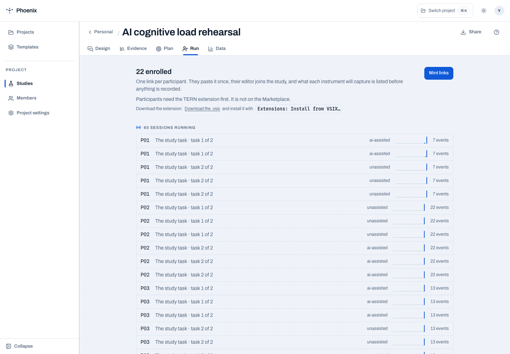
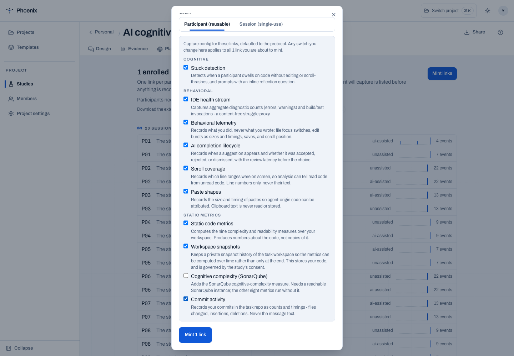
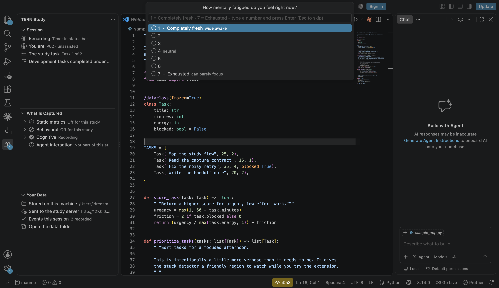
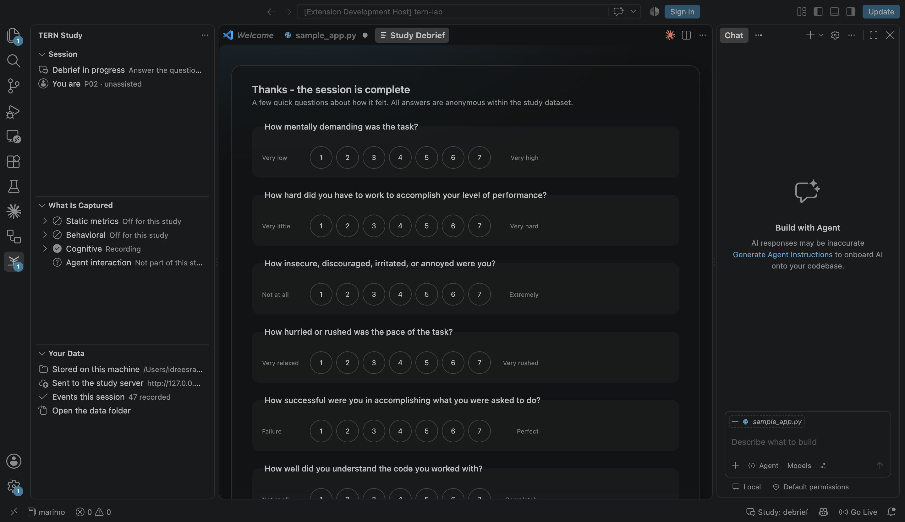
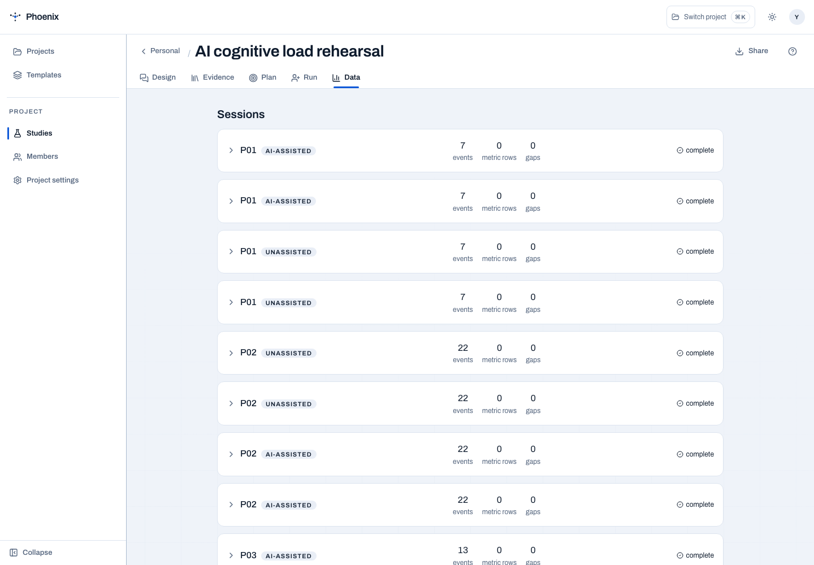
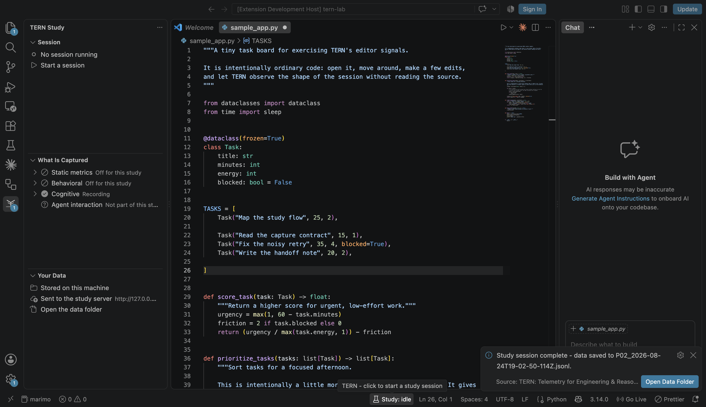

# Local demo runbook: PHOENIX + TERN

This is the one story to use for the researcher demo:

> “A researcher wants to know whether AI assistance changes developer cognitive
> load and working behaviour. PHOENIX turns that question into a
> counterbalanced within-subjects study. TERN runs the approved session inside
> VS Code, records privacy-preserving editor signals, and returns one joined
> timeline for analysis.”

The demo is illustrative only. It is not an ethics approval, a participant
sample, or evidence for a research claim.

## 1. Start the open-source local stack

From the repository root:

```bash
npm --prefix platform install
npm --prefix platform run build
npm --prefix extension install
npm --prefix extension run compile

# Prepare a deterministic local database and the 15,000-paper repertoire.
# The import is idempotent; the first run takes a little while.
DEMO_DB=/tmp/phoenix-demo.sqlite3
MIDDLEWARE_DB="$DEMO_DB" uv run python -m middleware demo-seed
MIDDLEWARE_DB="$DEMO_DB" uv run python -m middleware corpus-import
# Optional writable fallback: complete protocol + accepted design record.
MIDDLEWARE_DB="$DEMO_DB" uv run python -m middleware backup-seed

# Terminal 1: local middleware + built platform UI
MIDDLEWARE_PORT=8001 \
MIDDLEWARE_DB="$DEMO_DB" \
MIDDLEWARE_WEB="$PWD/platform/dist" \
MIDDLEWARE_CORPUS_BOOTSTRAP=0 \
MIDDLEWARE_AUTH= \
uv run python -m middleware
```

Open [http://127.0.0.1:8001](http://127.0.0.1:8001). Use an owned Personal study
for the live walkthrough and dry run. The seeded demo project is intentionally
viewer-only, so it is not the right place to mint participant links or run
simulations. If you need a clean rehearsal, use a new `DEMO_DB` path.

For a guaranteed local fallback, open the owned **My project** and the study
`ai-cognitive-load-demo`. `backup-seed` gives it a complete 7/7 design and an
approved protocol, so you can go straight to **Run → Enrollment**, mint a link,
and connect TERN. If port 8001 is already occupied, use another local port and
the minted connection link will carry that endpoint through to the extension.

If the design conversation says that no model is configured, continue with the
deterministic Repertoire path below. A model-backed conversation requires
`MISTRAL_API_KEY`; the rest of the platform does not.

## 2. Design the study conversation

Use this short talk track before touching the controls. It makes the product
benefit legible: PHOENIX turns a vague question into an auditable protocol,
then TERN executes only what that protocol approved.

| Turn | What to say or show |
| --- | --- |
| Researcher | “I want to know whether AI assistance changes developers’ cognitive load and working behaviour in VS Code.” |
| PHOENIX | “Compare the same developer under AI-assisted and unassisted conditions, counterbalanced. Capture task behaviour, lightweight fatigue probes, and a short debrief. Do not capture source text or clipboard content.” |
| Researcher | “Use a short Python maintenance task. I need task time/behaviour, perceived effort, and fatigue as the outcomes.” |
| PHOENIX | Show the proposed moves, their grounded references, the instruments, and the prescribed paired tests. Accept only the moves you can defend. |
| Researcher | “Apply this draft.” |
| PHOENIX | Show the protocol rail changing from draft to compiled, then move to Plan. |

If no model key is available, show the same design decision through
**Repertoire → Within-subjects crossover + Cognitive-load comparison → Merge 2**.
Say explicitly that this is the deterministic fallback for the same method
design, not a different product path.

## 3. Design one study in the UI

1. Open **Repertoire**.
2. Select **Within-subjects crossover** and **Cognitive-load comparison**.
3. Choose **Merge 2**, review the proposed questions and method, then name the
   study `AI cognitive load rehearsal`.
4. Open **Plan** and point out the chain: research questions → instruments →
   prescribed tests. For this example the useful plan is:

   - objective task outcome → paired exact Wilcoxon signed-rank;
   - debrief subscales → paired TLX comparison;
   - fatigue probes → paired condition comparison.

5. Open **Run → Enrollment**, choose **Mint links**, and keep the link
   participant-scoped/reusable. The link is a credential: copy it only into
   the participant IDE and do not put it on slides or in a commit.



In the mint dialog, enable only the streams needed for this rehearsal. Keep
SonarQube and external producers off unless the corresponding runner is part of
the session. TERN receives the approved scope at pairing and shows a pre-flight
summary before recording.



The design benefit to emphasize is that the researcher chooses the capture
scope before the participant starts. TERN receives that scope at pairing and
shows a pre-flight summary before recording.

## 4. Run the participant session in VS Code

If the extension is not already loaded, open `extension/` in VS Code and press
**F5**. In the Extension Development Host, open
`extension/examples/tern-lab`.

For the real platform integration, use the minted participant link: run
**TERN: Connect to Study**, paste the local connection string, accept consent,
and read the capture pre-flight. Then run **TERN: Start Study Session**. The
linked study owns the session duration and capture scope; do not silently
shorten those settings for a real participant. For a fast standalone TERN-only
rehearsal, change the workspace settings before starting a session and explain
that it is local-only.

Use `sample_app.py` as the task. The one-minute instrument choreography is:

| Participant action | What it demonstrates |
| --- | --- |
| Open `sample_app.py` and switch focus | file/window focus events |
| Scroll down and back up | visible line-range/scroll coverage |
| Copy a line, paste it, make a small edit, undo, and save | clipboard size, edit-burst origin, save event, undo-redo origin |
| Leave the caret in the blocked-task region and move it slightly for ~15 seconds | stuck detection and the inline prompt |
| Stop interacting for the configured idle window, then move the caret | idle → active heartbeat transition |
| Run **TERN: Log Fatigue Now** and choose a 1–7 response | in-flow cognitive probe |
| End the session from the status bar | timer end, attention flush, debrief, local JSONL finalization |

The extension records sizes, shapes, line numbers, timings, and salted hashes;
it does not record raw code, keystrokes, or clipboard text. Workspace snapshots
are the explicit content-touching exception and must be consented to.



At the end, answer every debrief rating shown (six core items, plus the
AI-condition item when applicable) and submit. The local source of truth is:

```text
extension/examples/tern-lab/.study-data/<participant>_<timestamp>.jsonl
```



## 5. Close the loop as the researcher

Return to **Data** in PHOENIX. Show three distinctions:

1. **Live participant data**: the real TERN session, with event count, gaps,
   condition, task join key, and local/mirrored provenance.
2. **Synthetic dry run**: ten simulated participants through the same ingest
   path. Synthetic numbers are for method rehearsal, never findings.
3. **Analysis handoff**: the protocol and dataset are handed to a notebook,
   not hidden behind an unexplained p-value.



The verified local rehearsal produced a complete 18-event P04 session with
focus, save, visible-range, edit-burst, AI-suggestion, fatigue, attention,
heartbeat, and debrief events. A second P03 smoke test verified the repaired
task join: 5 events, zero integrity flags, and a stamped `task` key. The
reproducible dry run reported **3/3 prescribed analyses ran** over 6 synthetic
participants and 12 synthetic sessions.



## 6. Hand the researcher the notebook

The repository includes the generated starter handoff for this example:

- [starter notebook](examples/demo-rehearsal/notebook.ipynb)
- [data dictionary](examples/demo-rehearsal/data-dictionary.md)

The notebook documents provenance, event fields, timeline construction, and
the exact recipes prescribed by the protocol. It deliberately does not claim
to have run a confirmatory analysis. To generate the same handoff from a live
local study, use the download endpoint:

```bash
STUDY_ID=ai-cognitive-load-rehearsal
curl -sS "http://127.0.0.1:8001/studies/$STUDY_ID/notebook" \
  -o "$STUDY_ID-notebook.zip"
unzip -o "$STUDY_ID-notebook.zip" -d handoff
```

Then export the dataset from the Data tab and point the notebook's final cell
at that JSON export. The researcher can continue with the generated recipe
imports or replace them with a preregistered analysis.

## What to say in the room

“PHOENIX protects the method: the study is designed, versioned, assigned, and
analysed as one protocol. TERN protects the session: the participant stays in
VS Code, sees consent and capture scope, and gets a local-first record. The
middleware joins the streams, detects gaps, and makes the handoff reproducible.
The benefit is traceability from research question to participant event to
analysis—not just a dashboard with numbers.”

## Fast recovery

- Live deployment shows a Railway browser/traffic check: switch to the local
  stack above; it is the deterministic open-source path.
- No model: use **Repertoire → Merge 2**; do not improvise a protocol live.
- Viewer permission error: switch to an owned Personal study before minting or
  simulating.
- Pairing link already used: mint a new participant link; never paste a token
  into documentation.
- No mirrored events: inspect the local JSONL first. HTTP mirroring is
  best-effort; the local file remains the source of truth.
- No quick stuck/fatigue prompt: use the manual fatigue command and restart the
  session. Do not shorten thresholds in an actual participant study without a
  protocol amendment.
