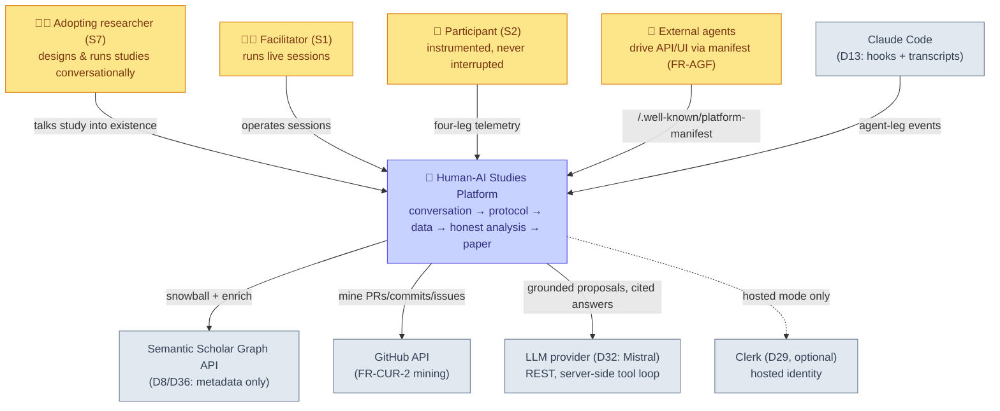
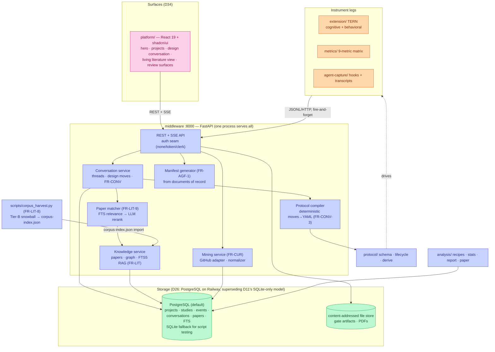
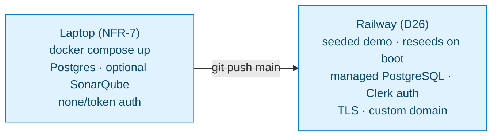

# Architecture — system design

C4-style, two levels. Traces: FR-PLAT (shell), FR-CONV (conversation),
FR-LIT-8/9/10 (corpus + matching + living view), FR-CUR (mining),
FR-AGF (manifest), D34 (surfaces) and the instrument legs.

## Level 1 — system context

Boundary rules (unchanged invariants): participant data never leaves
facilitator-controlled storage (NFR-5); the LLM sees papers, templates,
drafts, aggregates — never row-level events (FR-ETH-4); every external
service is optional and degrades gracefully (NFR-4).

## Level 2 — containers

Key placements, argued:

1. **The compiler lives server-side, next to the protocol package** —
   determinism (FR-CONV-3) is testable only where one implementation
   exists; the UI renders diffs, never computes them.
2. **The matcher is a service, not a UI feature** — FR-LIT-9's
   degradation ladder (FTS-only when no LLM key) must be one code path;
   both surfaces and the manifest consumers get identical matches.
3. **Harvest is a script, not a service** (D36) — corpus growth is an
   editorial batch act with a versioned gate, not a runtime behavior;
   its *output* (`corpus-index.json`) is what the platform imports.
4. **One process serves everything** (NFR-7) — the platform, conversation,
   knowledge, mining, and manifest are routers inside the one FastAPI app;
   `docker compose up` remains the whole story, SSE included.

## Deployment topology

Railway is the sole deployment target for the production service. Local
development mirrors it exactly (PostgreSQL, single container).

