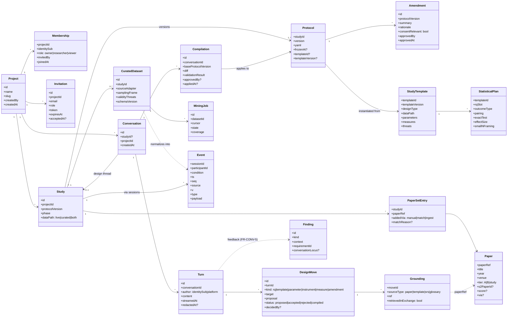

# Data model — UML class view

Traces: FR-PLAT-1/2 (projects, roles), FR-CONV-1/3/6 (conversation,
moves, elicitation record), FR-TPL-1/2 (templates, statistical plans),
FR-LIT-8/9 (corpus tiers, matching), FR-CUR-1/3 (curated datasets),
plus the event/paper tables they join. PostgreSQL throughout (D26); SQLite
fallback for script-only testing. Names follow the glossary (golden rule 4).



## Modeling decisions (the why)

1. **`Conversation.studyId` is optional** — the "new study" thread
   exists *before* the study does (FR-CONV-1); the study is created by
   the first approved compilation and the thread re-binds. This is what
   "talk a study into existence" means at the schema level.
2. **`DesignMove` hangs off `Turn`, decisions are separate fields** —
   the elicitation record (FR-CONV-6) must show what was proposed *and*
   what was decided, by whom, without mutation; redaction tombstones a
   Turn but never a DesignMove or Compilation (decisions are never
   silently unmade).
3. **`Grounding.retrievedInExchange`** operationalizes FR-CONV-2's
   cite-what-you-retrieved rule as data — the grep-the-output test reads
   this flag, not prose.
4. **`Paper.tier`** carries corpus provenance (FR-LIT-8): `A`
   (hand-curated seed), `B` (harvested, with `score` + `via` trail),
   `study` (ingested directly by a researcher). Matching (FR-LIT-9)
   ranks across tiers but always *displays* the tier — provenance is UI,
   not just metadata.
5. **`Event` is the convergence point** — every concept reaches the
   timeline through the join keys + the `source` column. The analysis
   pipeline cannot tell a curated study from a live one downstream of the
   normalizer, which is exactly the point (FR-CUR-1).
6. **`Finding.conversationLocus`** closes the feedback loop
   (FR-CONV-5): platform evolution proposals cite the exact turns that
   motivated them.
```
