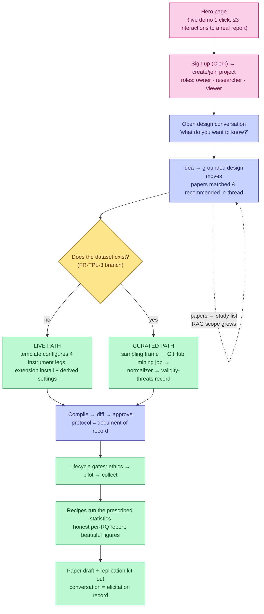
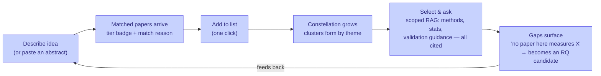
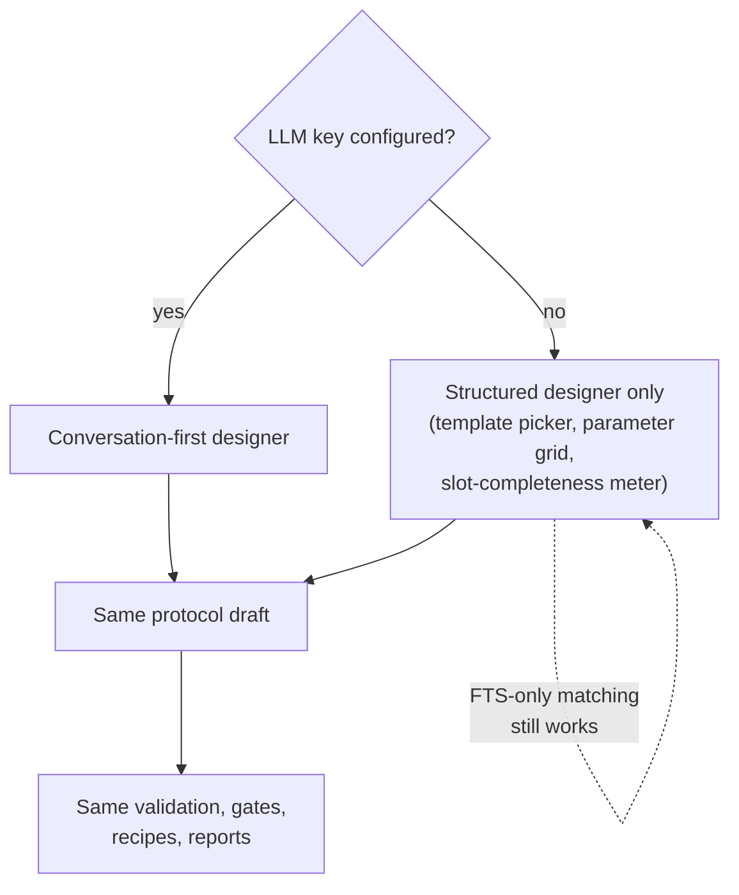

# User flows

## 1. S7's journey — arrival to running study (FR-PLAT-4, FR-CONV, FR-TPL-3)

## 2. The literature-review loop (FR-LIT-9/10) — "it becomes easy"

## 3. No-LLM degradation path (FR-CONV §5, FR-TPL-3 rev 2)

The platform is **fully usable with zero external services**: matching
degrades to FTS relevance, the designer to the structured form, the
graph to cached edges — nothing load-bearing is cloud-owned (NFR-4/5/7).
