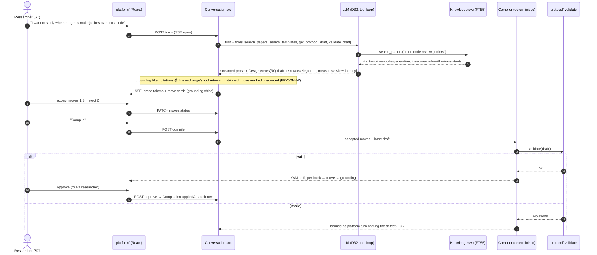
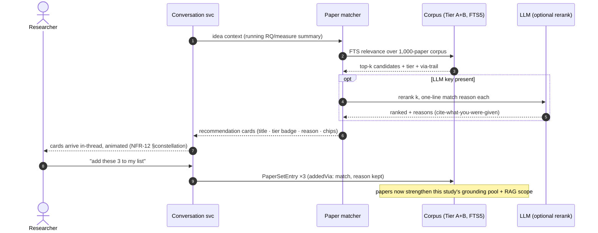

# Sequence diagrams — the five signature interactions

## 1. Design-move lifecycle (FR-CONV-1/2/3)

The heart of the platform: a researcher turn becomes grounded proposals
becomes protocol.



## 2. Papers matched to the idea, mid-conversation (FR-LIT-9)



## 3. Corpus harvest (FR-LIT-8, D36 — batch, editorial)

```mermaid
sequenceDiagram
    autonumber
    actor O as Owner/cron
    participant H as corpus_harvest.py
    participant S2 as Semantic Scholar API
    participant IDX as corpus-index.json / CORPUS.md
    participant IMP as Platform importer

    O->>H: uv run … --target 1000
    loop 100 Tier-A seeds (paced, cached, resumable)
        H->>S2: paper/arXiv:{seed}?fields=refs+cites(nested)
        S2-->>H: ≤200 candidate mentions
    end
    H->>H: dedupe → quality gate (verifiable ID, age-scaled citation floors, fresh allowance)
    H->>H: rank = freshness×1.6 + log₁₀(cites+1)×2 + seed-connectivity×1.5 + venue
    H->>IDX: Tier B rows (ref, s2PaperId, score, via[]) — nothing synthesized
    O->>IMP: import corpus-index.json
    IMP-->>IMP: Paper rows tier=B; FTS index extended; graph gains hollow→solid nodes
```

## 4. Post-ethics amendment (FR-CONV-4 — evolve on the fly, never sneak)

```mermaid
sequenceDiagram
    autonumber
    actor R as Researcher
    participant CONV as Conversation
    participant COMP as Compiler
    participant LC as Lifecycle (gates)
    actor E as Ethics board (S3)

    R->>CONV: "add an eye-strain probe every 20 min"
    CONV-->>R: move card + caution: new data stream ⇒ consent-relevant
    R->>CONV: accept → compile → approve (owner role required post-freeze)
    COMP->>LC: amendment(consentRelevant=true)
    LC->>LC: protocolVersion++ · Amendment row · flag requires-re-approval
    LC-->>R: new sessions BLOCKED for data-collection until artifact uploaded
    Note over LC: running sessions untouched (NFR-1); collected data intact, version-tagged
    R->>E: amended consent + protocol delta (generated from Amendment row)
    E-->>R: approval artifact
    R->>LC: upload artifact → gate clears → new sessions run v(n+1)
```

## 5. Talk to your papers (FR-LIT-10 — scoped RAG with guidance)

```mermaid
sequenceDiagram
    autonumber
    actor R as Researcher
    participant VIEW as Living literature view
    participant KNOW as Knowledge svc
    participant LLM as LLM (D32)

    R->>VIEW: lasso-select 6 papers in the constellation
    VIEW->>KNOW: set RAG scope = selection
    R->>VIEW: "how did these validate their measures? what should I use?"
    VIEW->>KNOW: scoped FTS retrieval (6 papers only)
    KNOW-->>LLM: chunks + template registry excerpts (never events, FR-ETH-4)
    LLM-->>VIEW: streamed answer, every claim chip-cited into the 6
    Note over VIEW: cited papers pulse as their chips stream in (NFR-12); unscoped papers dim
    VIEW-->>R: "…construct validity via TLX (cite) … for yours: ziegler-… template prescribes exact Wilcoxon (chip)"
```
