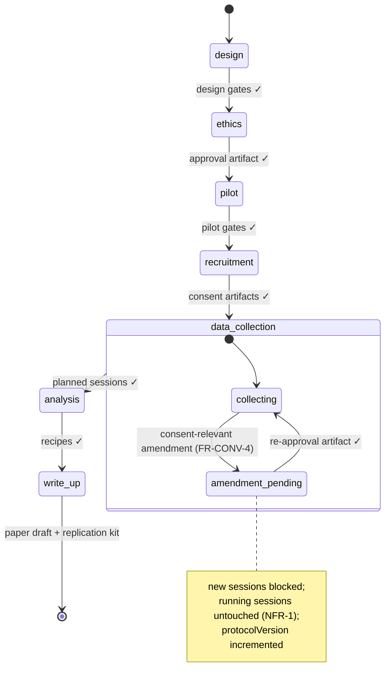
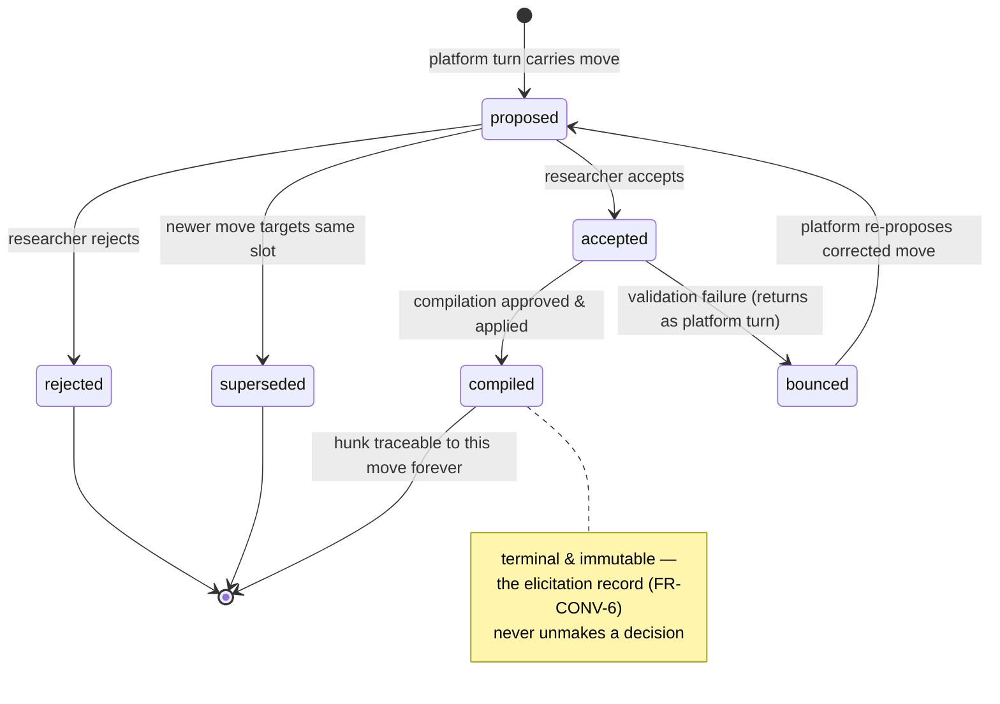
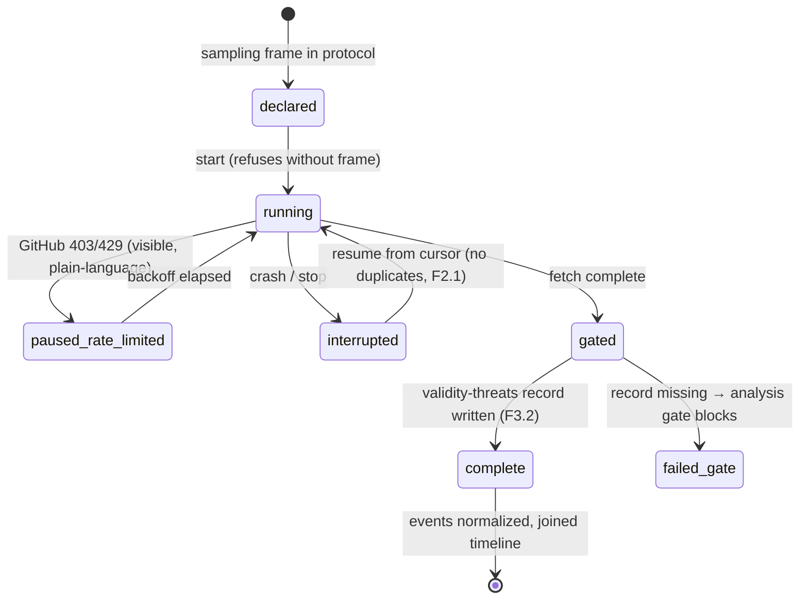
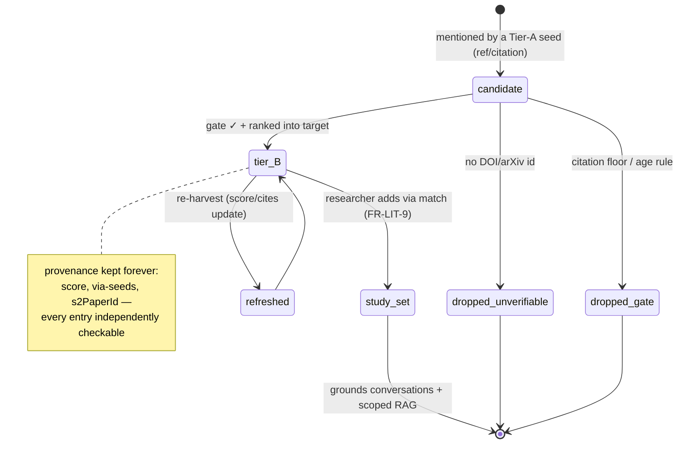
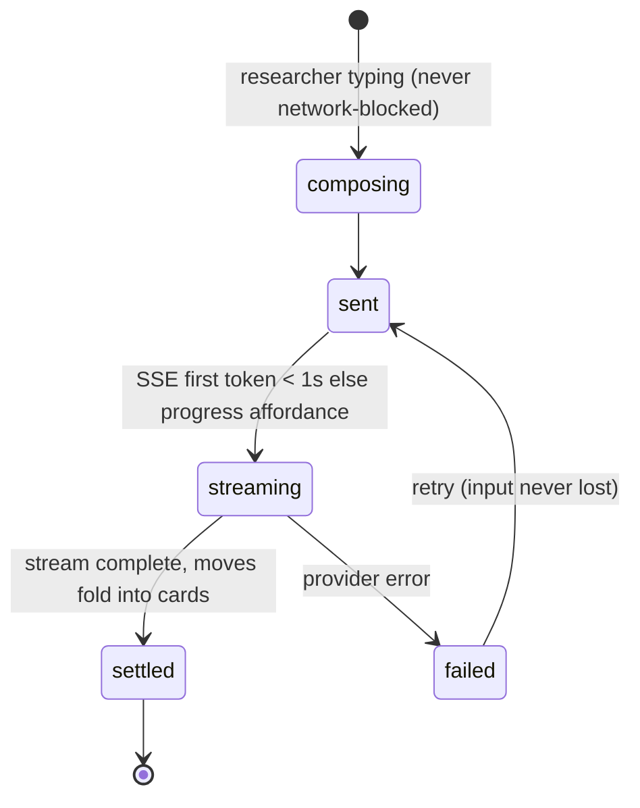

# State machines

## 1. Study lifecycle (FR-PROT-3 — v1, unchanged; v2 adds the amendment loop)

## 2. Design move (FR-CONV-1/3)

## 3. Mining job (FR-CUR-2)

## 4. Corpus entry (FR-LIT-8)

## 5. Conversation turn streaming (FR-CONV-1, NFR-12)

