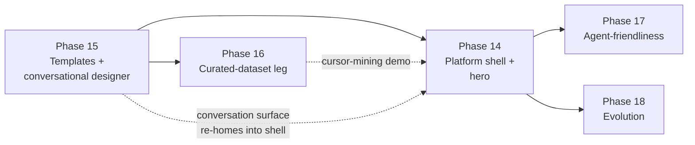

# The roadmap: one platform, end to end

This directory is the **living roadmap**: the complete, buildable plan
for the conversational research platform, from the first pixel of the
hero page to the last byte of the replication kit. It is written to be
*executed*: every phase
below is a self-contained phase spec a fresh session can pick up and
build from, with enough precision to never wonder what was meant and
enough declared freedom to never get bogged down.

Read `docs/VISION.md` first. The family specs in `requirements/specs/`
are the requirements of record with numbered fit criteria; the design
tree in `docs/design/` (architecture, data model, sequences, state
machines, UI/motion) is the design contract. These phase specs sequence
all of that into buildable slices and add the implementation-level
decisions the specs left open.

## What we are building

A researcher arrives with an idea and *talks* it into a study. The
platform answers with the literature: an uncapped, quality-gated
corpus (1,000 papers as the floor) and a
registry of citable study templates, proposing design moves the
researcher accepts or rejects one card at a time. Accepted moves compile
deterministically (no LLM in the compiler) into a versioned YAML
protocol: the single document of record that configures instruments,
gates the lifecycle, prescribes the exact statistics, and emits the
report, paper draft, and replication kit. Data arrives from live
instrumented sessions (the four capture legs) or from curated mining of
existing sources (GitHub first) through one join-key schema, so every
recipe and figure works identically on both. Mid-study, the conversation
stays open: changes flow through phase-aware amendments, visible and
consent-gated, never sneaky. The whole thread is stored as the study's
elicitation record: the idea, the evidence, the decisions, and the study
they became, navigable in both directions.

Fully usable with **zero external services**: no LLM key → the
structured designer and FTS matching; offline → cached corpus and local
validation. The cloud makes it conversational; nothing load-bearing is
cloud-owned.

## The phases

The plan is one arc: **phases 01–13** build the methodology foundation (the
protocol engine, the four instrument legs, ingestion, analysis, the knowledge
layer, ethics/ops); **phases 14–18** build the platform layer on top of it
(shell + hero, templates + conversational designer, curated data,
agent-friendliness, evolution). The platform layer is sequenced by proof-value
per unit of engineering: the methodology core first, shell polish after,
metadata and evolution last.

### Foundation (01–13)

| Phase | Title | Satisfies | Status |
| ----- | ----- | --------- | ------ |
| [01](01-requirements-foundation.md) | Requirements & research foundation | RQ-F1..F4, NFR-10, NFR-11 | ✅ |
| [02](02-protocol-and-lifecycle.md) | Study protocol & lifecycle | FR-PROT-1..5/7/9, FR-ETH-1 | ✅ |
| [03](03-ingestion-middleware.md) | Ingestion middleware (the :8000 hub) | FR-ING-1..6, NFR-2/7 | ✅ |
| [04](04-static-metrics-leg.md) | Static-metrics leg | FR-INST-4, FR-INST-6 | ✅ |
| [05](05-cognitive-leg.md) | Cognitive leg (fatigue, stuck, session) | FR-INST-1/2/3/13/14 | ✅ |
| [06](06-behavioral-leg.md) | Behavioral telemetry leg | FR-INST-5/8/9/10/11/12 | ✅ |
| [07](07-agent-interaction-leg.md) | Agent-interaction leg | FR-AGENT-1/2/3/5, FR-INST-15/16/17 | ✅ |
| [08](08-analysis-recipes.md) | Analysis recipes & honest statistics | FR-ANA-1..4, NFR-6/8 | ✅ |
| [09](09-knowledge-layer.md) | Knowledge layer (papers, graph, assistant) | FR-LIT-1/2/3/4/6, FR-ETH-4 | ✅ |
| [10](10-corpus-at-scale.md) | Corpus at scale + idea↔paper matching | FR-LIT-7/8/9/10 | 🔶 |
| [11](11-paper-and-retrospective.md) | Paper draft & self-improvement retrospective | FR-ANA-6, FR-META-1/2/3 | 🔶 |
| [12](12-replication-and-recipes.md) | Replication kit & published-paper recipes | FR-PROT-7, FR-ANA-5, RQ-F3 | ✅ |
| [13](13-ethics-privacy-ops.md) | Ethics, privacy & operations | FR-ETH-2/3, FR-OPS-1..7, NFR-1/5 | 🔶 |

### Platform layer (14–18)

| Phase | Title | Satisfies | Status |
| ----- | ----- | --------- | ------ |
| [14](14-platform-shell.md) | Platform shell + hero | FR-PLAT-1..5, FR-OPS-5/7, NFR-12 foundation | 🔶 built: backend + shell UI green; server-seeded demo + browser NFR-12 evidence pending |
| [15](15-templates-and-conversational-designer.md) | Templates + conversational designer | FR-TPL-1..4, FR-CONV-1/2/3/6, FR-LIT-9, FR-LIT-8 importer | 🔶 conversation/compiler/approval/elicitation record + corpus importer + match ladder + template registry green; remaining: FR-TPL-3 form path + 2 of 4 seed templates pending recipes |
| [16](16-curated-dataset-leg.md) | Curated-dataset leg | FR-CUR-1/3 | ✅ normalizer + validity-threats-record chain green; FR-CUR-2 (GitHub adapter) built then retired 2026-08-06, see phase doc |
| [17](17-agent-friendliness.md) | Agent-friendliness | FR-AGF-1..3, FR-PROT-9 | ✅ built: manifest, generated AGENTS.md + CI drift gate, agent-participant protocol, `data-agent` annotations |
| [18](18-evolution.md) | Evolution: amendments | FR-CONV-4 | 🔶 built: amendment engine green server-side; UI built + gated; live transport + browser NFR-12 evidence deferred. (Also built FR-CONV-5, the platform's own feedback loop; removed 2026-08-06 as unused — see the phase doc.) |

Status key: ✅ done · 🔶 partial · ⬜ open. A phase is **done only when
its verification steps ran green, its row here is flipped, and its
requirement rows in `requirements/traceability.md` are flipped**;
finishing the code is not finishing the phase.

### Study conductor (19–21)

| Phase | Title | Satisfies | Status |
| ----- | ----- | --------- | ------ |
| [19](19-live-capture-link.md) | The live capture link | FR-INST-20/21, FR-ING-7, FR-DASH-10 | 🔶 built: mint/redeem/capture-config/server-stamped-ingest/streaming-status/pre-flight-visibility green (pytest + `node:test` + a live API walkthrough); the VS Code Extension Dev Host walkthrough and browser NFR-12 evidence are owner-run, pending |
| [20](20-capture-console.md) | The capture console (grounded per-metric toggles) | FR-INST-18, FR-DASH-11, FR-CONV-7 | ✅ built: toggle-as-amendment endpoint + catalog + FR-CONV-7 consent-relevance + `IdeHealthCollector` + `TogglePopover`; all pytest + `node:test` + build verified |
| [21](21-conductor-overlay.md) | The conductor overlay (in-editor cognitive load) | FR-INST-19, FR-DASH-12 | ✅ built |

### Study designer (22)

| Phase | Title | Satisfies | Status |
| ----- | ----- | --------- | ------ |
| [22](22-design-recommender.md) | The design recommender & archetype library | FR-TPL-4/6/7, FR-ANA-7/8 | 🔶 built: Slice A (parameterised recipes + figure forms + meta wiring to runner) + Slice C (analysisPlan compiler for prescription+figure moves) + design_assistant wired for prescription/figure suggestions; Wave-1 archetypes in registry; prescribe.py + suggest_figures.py complete. Remaining: Slice B platform UI (ranked shortlist cards), verify scripts, Slice D Wave-2 fill, NFR-12 evidence. |

### The session timeline (23)

| Phase | Title | Satisfies | Status |
| ----- | ----- | --------- | ------ |
| [23](23-session-timeline.md) | The session timeline (the swimlane view) | FR-DASH-4 | ✅ built |

### Import & extensibility tail (24)

| Phase | Title | Satisfies | Status |
| ----- | ----- | --------- | ------ |
| [24](24-import-extensibility-tail.md) | Import & extensibility tail | FR-AGENT-4, FR-CUR-4, FR-TPL-5 | 🔶 Slice A (generic-json transcript) + Slice B (ArchiveAdapter) + Slice C (TemplateSubmission endpoints) built; Slice C writes to live registry cannot be integration-tested without polluting committed files; unit tests validate schema + routing |

### The instrument surface (25)

| Phase | Title | Satisfies | Status |
| ----- | ----- | --------- | ------ |
| [25](25-instrument-surface.md) | The instrument surface (extension sidebar, four legs, publishable) | FR-INST-22, FR-DASH-13, FR-OPS-8 | 🔶 Specced 2026-07-26; Slices A–D built and green (532 pytest, 146 `node:test`, platform gate): four-leg toggle catalog + `leg_summary`, portable `core/legs.ts`, the three sidebar tree views on an activity-bar container, and a packageable `.vsix`. Remaining: Extension Dev Host walkthrough (owner-run), the platform console grouping toggles by leg, and a Marketplace publisher id (owner-registered) |

## The load-bearing walls (fixed in every phase)

These are the platform's physics. Every slice of every phase obeys them;
no degree of freedom below ever overrides them.

1. **The protocol is the sole document of record** (FR-PROT-1). The
   conversation produces and amends *drafts*; everything downstream
   (instruments, gates, analysis, paper) derives from the YAML alone.
2. **No LLM in the compile step** (FR-CONV-3). The LLM proposes; a pure
   function `(draft, acceptedMoves) → draft'` produces YAML. Replay is
   byte-identical, and that is a CI-gated test.
3. **Cite only what you retrieved** (FR-CONV-2, FR-ETH-4). A move may
   carry only grounding returned by tools in that exchange; unsourced
   moves are labeled, never hidden, and `grounding: none` is recorded in
   the compiled protocol, not just displayed.
4. **Join keys everywhere** (FR-INST-6). On every row of every leg, live
   or mined: `participantId`, `condition`, `sessionId`, timestamp, schema
   version. A source that can't provide them doesn't ship.
5. **Schema versioning, consumers branch** (FR-PROT-2, NFR-4). Any
   change to event or protocol shape bumps the version; nothing guesses.
6. **Never interrupt the participant** (NFR-1/2). Sensors and sinks are
   fire-and-forget; running sessions are never reconfigured; loss is
   detectable via `seq` gaps, never silent.
7. **Privacy by construction** (FR-ETH-2). Aggregates, shapes, salted
   hashes; no raw code, keystrokes, or identities, and mined *strangers*
   get the same protection as consented participants. The assistant sees
   papers, templates, drafts, aggregates; never row-level events, ever.
8. **Honest statistics** (NFR-8). Exact tests, effect sizes, per-cell n,
   small-n framing; never a bare p-value. Statistics never animate.
9. **Everything degrades** (NFR-4/5/7). No LLM key, no GitHub token, no
   network: the platform loses convenience, never function. One process,
   PostgreSQL by default (SQLite fallback), `docker compose up` is the
   whole story; port 8000 is the contract.
10. **The experience bar is a requirement** (NFR-12). Both themes, WCAG
    2.2 AA, reduced-motion parity, streaming without layout shift, zero
    raw hex/ms/px in components, keyboard-complete. Every phase's
    acceptance includes its walkthrough.
11. **Glossary names win** (`requirements/glossary.md`): `participant`
    not `user`, `condition` not `group`, `recipe` not `script`, in code
    identifiers, schema fields, and UI copy alike.
12. **New dependency ⇒ decision row first** (`build-vs-adopt.md`,
    NFR-10). The substrate is decided (D34/D37: React 19 + Vite +
    Tailwind v4 + vendored shadcn; D11: SQLite → superseded by D26 PostgreSQL; D32: Mistral REST);
    anything beyond it needs its D-row before `npm install`.

## The autonomy charter (where the builder is free)

These specs are precise about *contracts* and deliberately open about
*construction*. If you are the model executing a phase: the following
are yours to decide, without asking, as long as the walls above stand.
Use the freedom: a bogged-down builder re-reading the spec for
permission is a failure mode this section exists to kill.

- **Code structure.** Module layout, file naming, component composition,
  hook/service factoring, test organization: yours. Match the existing
  style of the package you're in; don't invent parallel patterns.
- **Interaction design within the registers.** The UI/motion spec fixes
  tokens, registers (warm/precise), the quirk budget, and the named
  signature moments. Everything else (spacing, layout grids, empty-state
  copy, hover details, how a table sorts) is yours, judged against
  "would a designer sign this?". Invent micro-moments freely within the
  quirk budget; the spec's inventory is a floor, not a ceiling.
- **Microcopy.** Voice rules are fixed (first person for platform
  actions, no IDs in UI, no exclamation marks near numbers); the words
  are yours.
- **Algorithms and internals.** Ranking weights inside the match ladder,
  debounce timings, cache shapes, pagination sizes, worker vs. main
  thread: yours, provided the fit criteria still pass and constants
  live in one named place (not sprinkled literals).
- **Slice order within a phase.** Reorder or merge slices when
  dependencies allow; record what actually happened in the tracker and
  traceability log. Landing part of a later phase early (as Phase 15 slice
  1 did with the `platform/` scaffold) is expected when the build order
  note permits it.
- **Deviate with a log line, never in silence.** If a spec detail turns
  out to be wrong or a better construction exists, prefer the invariant,
  build the better thing, and record the deviation in the phase's
  deviations log + `traceability.md`. A logged deviation is good
  engineering; a silent one is a defect.
- **Propose beyond the spec.** New ideas are welcome and cheap to
  legitimize: one requirement row (with priority + rationale) and a
  traceability line, then build. The ambition ledger below is a starting
  menu, not a fence.

What is *not* free: weakening a fit criterion, adding a dependency
without a D-row, touching the platform's engine invariants, skipping the
verification steps, or shipping a Must-displacing Could (rule 6:
no shell polish while methodology Musts are open).

## The proof: the trial studies

The platform is proven by running real studies through it; these are
the owner's own trial studies, not platform features:

1. **The retro-fit**: an already-run maintenance-task study described
   through the platform, using the `metr-rct-v1` published-design
   template (Phase 15, FR-TPL F1.2): proof the platform can express a study
   that already happened. The template is library content; this trial is
   a protocol instance; the two are separate.
2. **Cursor-style mining demo**: the curated path end to end on a
   committed fixture dataset (Phase 16, FR-CUR F1.1).

Together they exercise the live and curated branches, human and
agent-authored data, design and amendment, no-LLM and full-conversation.
Agent-*participant* support (FR-PROT-9) is proven directly by its schema
fixture and test suite (`protocol/tests/fixtures/agent-participant-v3.yaml`,
`test_agent_participants.py`).

## Ambition ledger (stretch: each needs its SRS row before build)

Ideas that would make the platform feel like nothing else, parked here
so they're neither lost nor smuggled in as orphan work. Any phase may
adopt one by adding its requirement row (Could unless argued otherwise)
and a traceability line first:

- **Protocol time-machine**: scrub through a study's design history;
  the diff rail replays compilations in sequence from the elicitation
  record (FR-CONV-6 data already supports it).
- **Grounding heat**: a protocol view where each line's background
  encodes how much evidence backs it; unsourced sections visibly cooler.
  The "how sure are we?" question answered at a glance.
- **Counterfactual branches**: reopen a rejected design move in a
  sandbox thread: "what would the study look like if we had said yes?"
  Compiles into a throwaway draft, never the record.
- **Replication passport**: the paper draft embeds a machine-readable
  block (kit hash, template version, corpus refs) so another platform
  instance can re-materialize the study from the PDF alone.
- **Constellation time-lapse**: replay the study's paper set growing
  over the design conversation's lifetime; the literature review as a
  30-second film.

## Execution notes

- Each phase spec is self-contained: read-first list, dependencies,
  slices, fit mapping, verification steps, deviations log. Follow it
  literally; deviations go in the log.
- Verification is never optional: `uv run pytest && uv run ruff check .`
  for Python, `npm run check` (or `npm run build && npm run lint`) in
  the touched frontend, plus the phase's named demos and the NFR-12
  walkthrough (both themes + reduced-motion, screenshots archived).
- Public-facing surfaces follow NFR-11: plain language, no requirement
  IDs. These internal specs use IDs freely; they are anchors, not
  jargon for its own sake.
