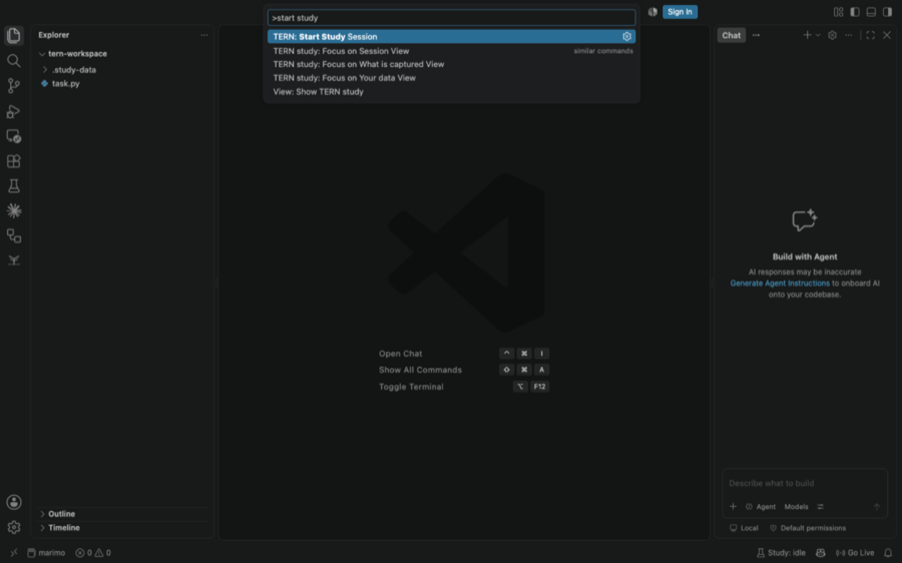
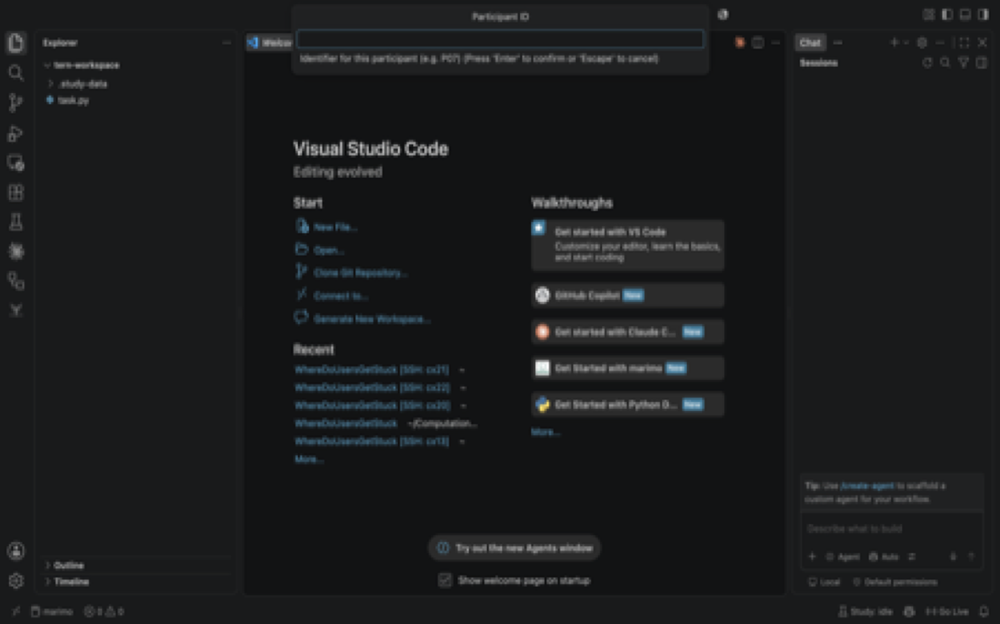
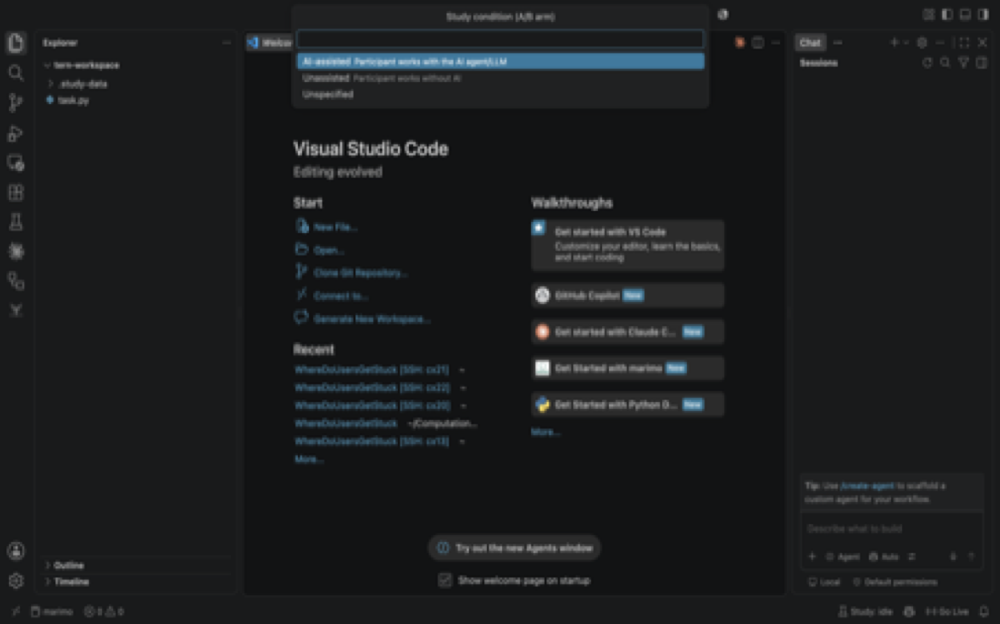
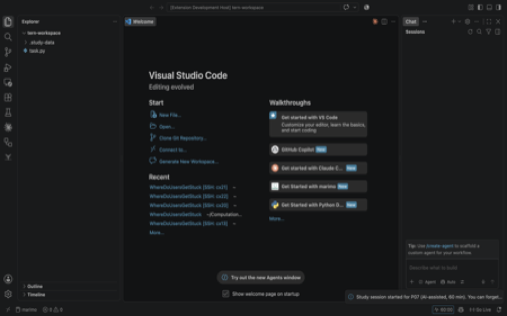
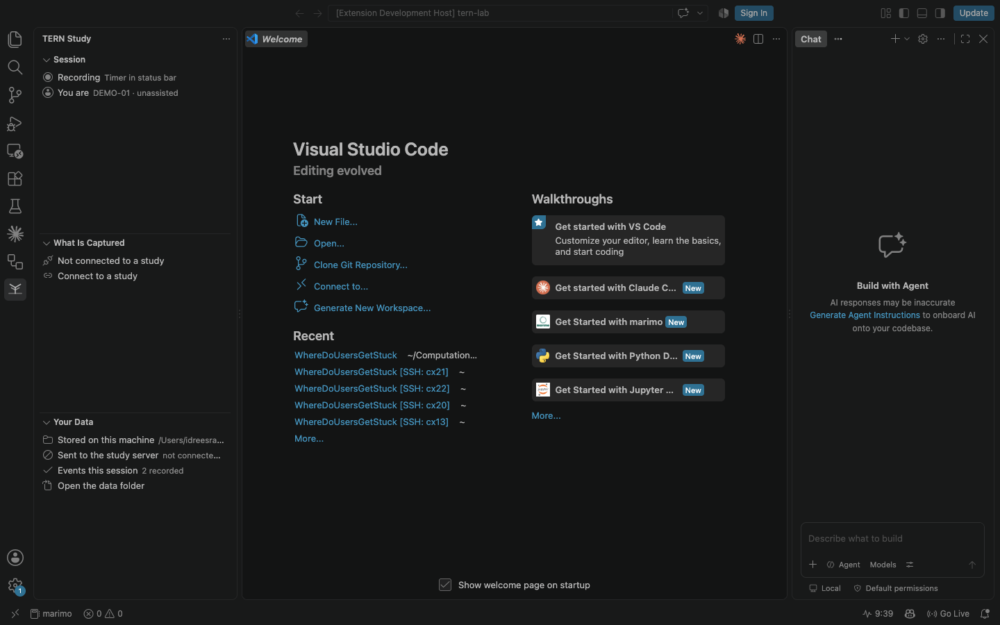
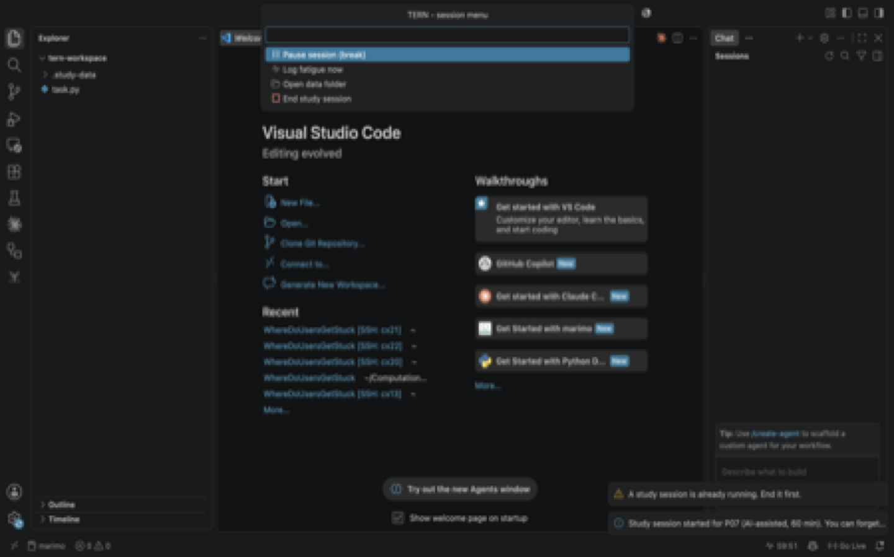
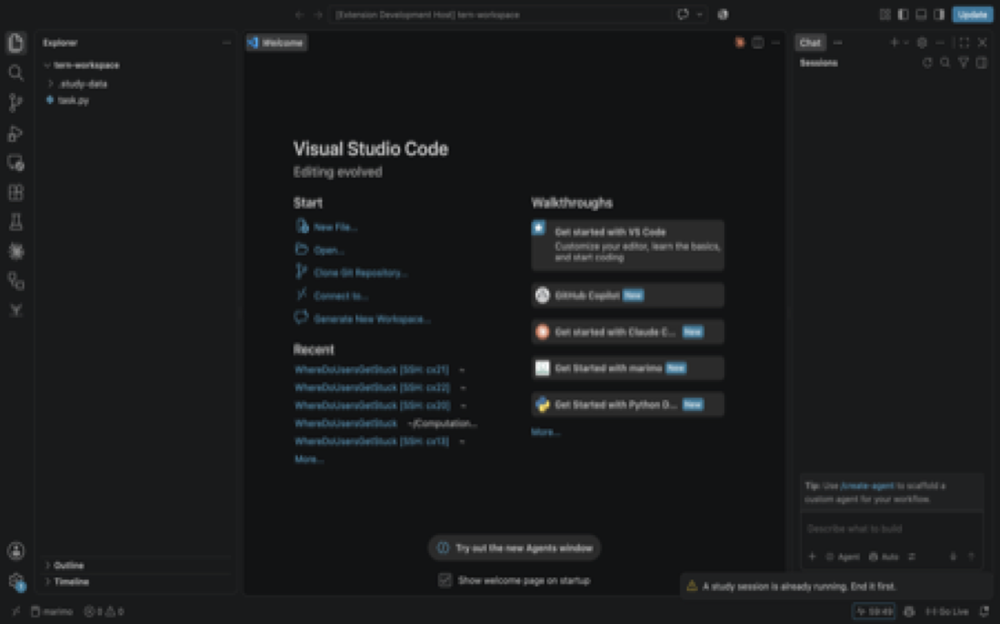
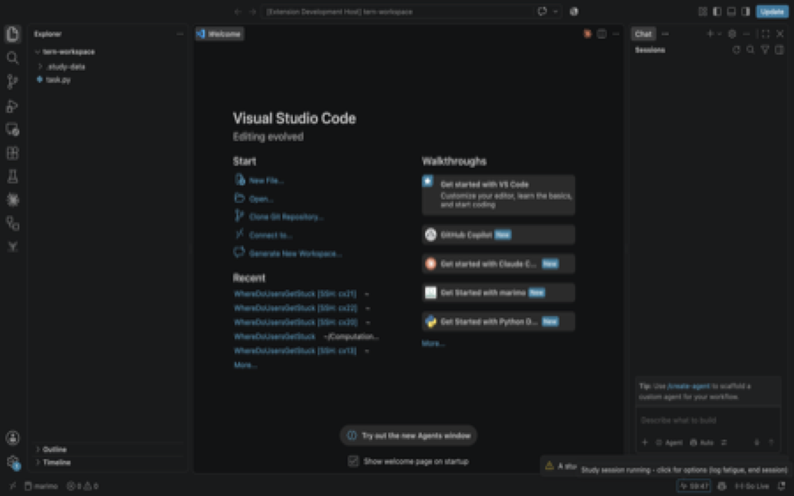
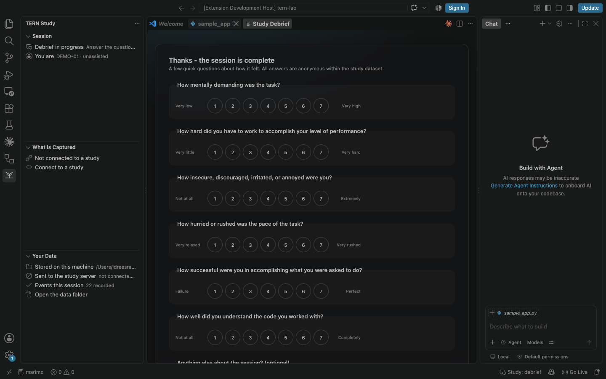

# Using TERN

A study session is a focused work interval, from the moment a participant
starts it to the debrief. Everything in between is captured as events.

## Starting a session

Click **`Study: idle`** in the status bar, or run _TERN: Start Study Session_
from the command palette (F1).

<figure markdown="span">
  { width="700" }
  <figcaption>All TERN commands are available from the command palette.</figcaption>
</figure>

1. **Participant ID** — enter the participant's ID, e.g. `P07`.
2. **Condition** — pick the A/B condition: **AI-assisted** or **Unassisted**.
   The condition is assigned by the study's counterbalanced rotation.
3. **Preflight check** — a summary of what will be captured and where the data
   will go. Nothing starts until you confirm.

<figure markdown="span">
  { width="700" }
  <figcaption>Enter the participant ID.</figcaption>
</figure>

<figure markdown="span">
  { width="700" }
  <figcaption>Pick the assigned condition.</figcaption>
</figure>

<figure markdown="span">
  { width="700" }
  <figcaption>Review the preflight summary and begin the session.</figcaption>
</figure>

## During the session

The only permanent UI is the **status-bar countdown** — the session clock in
minutes and seconds. Click it any time to open the session menu:

- **Log fatigue now** — answer a fatigue probe immediately.
- **Pause study session** — take a break; paused time is excluded from the
  study clock and the probe schedule.
- **Resume study session** — pick up where you left off.
- **End study session** — finish early and open the debrief.

<figure markdown="span">
  { width="700" }
  <figcaption>The status-bar countdown is the only permanent UI.</figcaption>
</figure>

<figure markdown="span">
  { width="700" }
  <figcaption>The session menu from the status bar.</figcaption>
</figure>

### Fatigue probes

A 7-point Likert micro-prompt (`1`–`7` + Enter, `Esc` to skip) appears at a
configurable interval as a native floating QuickPick. It **waits for a typing
pause** (≥4 s of silence, up to 60 s), so it never interrupts mid-keystroke.
You can also answer one anytime via **Log fatigue now**.

<figure markdown="span">
  { width="700" }
  <figcaption>The fatigue micro-prompt, keyboard-first.</figcaption>
</figure>

<figure markdown="span">
  { width="700" }
  <figcaption>Answer with 1–7 and Enter.</figcaption>
</figure>

### Stuck detection

When you dwell on the same code region without editing (while still visibly
active), or scroll-thrash back and forth re-reading the same area, a soft
rectangular border is drawn **directly around those lines** with clickable
actions above it:

*Yes, I'm stuck · No, just thinking · I'd like a hint · Dismiss*

Ignored prompts time out silently after 60 s — the timeout itself is recorded,
which is signal too.

## Ending a session

When the timer elapses — or you run _End Study Session_ — a frosted-glass
**end-of-study debrief** (NASA-TLX-inspired, same 7-point scale) opens
automatically.

<figure markdown="span">
  { width="700" }
  <figcaption>The NASA-TLX-inspired debrief.</figcaption>
</figure>

### Breaks and interruptions

- **Paused time** is excluded from the study clock and the probe schedule.
- An interrupted session (IDE crash, window reload) is offered for **crash
  recovery** on next launch, with the downtime counted as paused time rather
  than work.