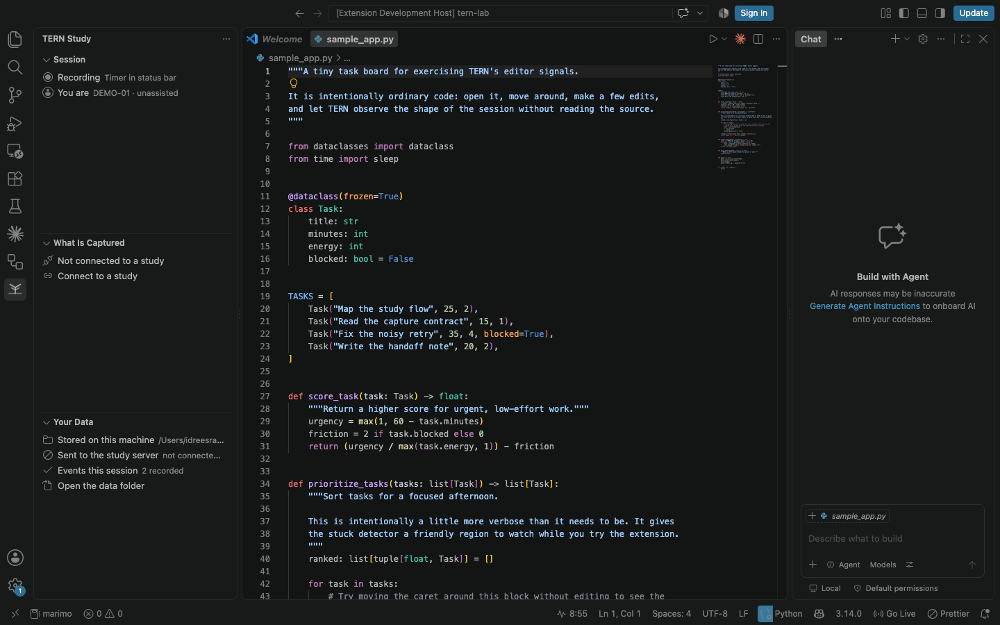

# Using TERN 1.0.1

A study session is a focused work interval, from the moment a participant
starts it to the debrief. Everything in between is captured as events.

## Starting a session

Click **`Study: idle`** in the status bar, or run _TERN: Start Study Session_
from the command palette (F1).

1. **Participant ID**  -  enter the participant's ID, e.g. `P07`.
2. **Condition**  -  pick the A/B condition: **AI-assisted** or **Unassisted**.
   The condition is assigned by the study's counterbalanced rotation.
3. **Preflight check**  -  a summary of what will be captured and where the data
   will go. Nothing starts until you confirm.

The participant prompt, condition picker, and preflight check are native VS Code
surfaces, so they inherit the editor's keyboard navigation and accessibility
behaviour. The preflight dialog is the last gate: choosing **Begin session** is
the moment the local event file is created.

## During the session

The **status-bar countdown** is the single live clock, in minutes and seconds.
The TERN sidebar mirrors the session state but deliberately does not redraw once
per second; this keeps the editor calm and avoids a flickering tree view. Click
the status-bar clock any time to open the session menu:

- **Log fatigue now**  -  answer a fatigue probe immediately.
- **Pause study session**  -  take a break; paused time is excluded from the
  study clock and the probe schedule.
- **Resume study session**  -  pick up where you left off.
- **End study session**  -  finish early and open the debrief.

<figure markdown="span">
  { width="700" }
  <figcaption>A real TERN session in the sample workspace: code stays in the editor, while the live clock stays in the status bar.</figcaption>
</figure>

### Fatigue probes

A 7-point Likert micro-prompt (`1`–`7` + Enter, `Esc` to skip) appears at a
configurable interval as a native floating QuickPick. It **waits for a typing
pause** (≥4 s of silence, up to 60 s), so it never interrupts mid-keystroke.
You can also answer one anytime via **Log fatigue now**.

### Stuck detection

When you dwell on the same code region without editing (while still visibly
active), or scroll-thrash back and forth re-reading the same area, a soft
rectangular border is drawn **directly around those lines** with clickable
actions above it:

*Yes, I'm stuck · No, just thinking · I'd like a hint · Dismiss*

Ignored prompts time out silently after 60 s  -  the timeout itself is recorded,
which is signal too.

## Ending a session

When the timer elapses  -  or you run _End Study Session_  -  a frosted-glass
**end-of-study debrief** (NASA-TLX-inspired, same 7-point scale) opens
automatically. During the debrief the status bar says **Study: debrief** and the
sidebar says **Debrief in progress**; the countdown is never left running behind
the survey.

<figure markdown="span">
  { width="700" }
  <figcaption>The NASA-TLX-inspired debrief.</figcaption>
</figure>

### Breaks and interruptions

- **Paused time** is excluded from the study clock and the probe schedule.
- An interrupted session (IDE crash, window reload) is offered for **crash
  recovery** on next launch, with the downtime counted as paused time rather
  than work.
