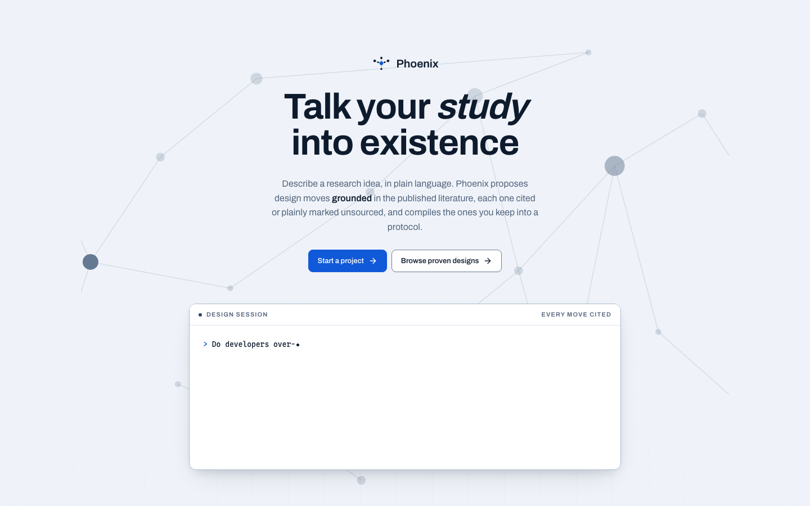

# PHOENIX · Human–AI Study Framework

Design, instrument, and analyse human–AI software-development studies — by
talking it through.

**PHOENIX** is a research platform that turns a study idea into a grounded,
statistically prescribed, ethics-ready protocol, and then instruments it
automatically on participants' machines.

<figure markdown="span">
  { width="800" }
  <figcaption>Describe your idea; PHOENIX talks back with the literature.</figcaption>
</figure>

## What this framework does

| Stage | What happens | Where |
| --- | --- | --- |
| **Design** | Describe your idea; accept or reject design-move suggestions one at a time. Every suggestion cites a real paper — or explicitly says it doesn't. | Platform |
| **Compile** | Accepted choices become a protocol deterministically — the same answers always produce the same protocol, no AI involved. Missing pieces are flagged. | Platform |
| **Run** | The protocol configures **TERN**, the VS Code extension, on each participant's machine. Task order is rotated so every participant meets every condition. | Platform → Extension |
| **Collect** | TERN tracks how participants felt (short surveys), what they did (edits, tab switches, stuck moments), and what the AI did. Never raw code, keystrokes, or clipboard text. | Extension |
| **Analyse** | You get a dataset shaped for your design, a data dictionary, and a starter notebook with the exact test to run. | Platform |

The framework spans two products, documented here in two sections:

- **[Platform](platform/index.md)** — the web app where you design, compile, and
  coordinate the study.
- **[TERN extension](extension/index.md)** — the VS Code extension participants
  run, capturing everything the protocol approved.

## Why it exists

Researchers studying human–AI software development face a reliability problem:
every study that designs its own instruments, instruments ad hoc, and analyses
with improvised statistics produces results that cannot be compared — or
trusted.

PHOENIX encodes the methodological knowledge instead: proven designs are bound
to the statistics they require, every instrument is configured from the
approved protocol, and the analysis plan is fixed before a single real session
runs. The step researchers fear most — *"will my statistics be right?"* — is
answered by construction.

## The four angles, in one place

| Leg | Instrument | What it captures |
| --- | --- | --- |
| How participants feel | TERN probes | Fatigue Likert, end-of-session TLX survey |
| What participants do | TERN telemetry | Focus switches, edit bursts, pastes (sizes only), stuck episodes |
| What the AI does | agent-capture | Tool calls, transcripts, suggestion lifecycle |
| What the code looks like | metrics | Complexity profile of the code produced |

Every leg is configured per study from the protocol and disclosed in the
participant's consent statement. A capture config the researcher has not
approved never runs.

## Quick start

Prerequisites: [uv](https://docs.astral.sh/uv/), Node 22, and a
[Mistral API key](https://console.mistral.ai/) (needed only for the design
conversation; everything else works without one).

```bash
git clone https://github.com/idreesshaikh/human-ai-studies-framework.git
cd human-ai-studies-framework

uv sync --all-packages
(cd platform && npm ci && npm run build)

echo "MISTRAL_API_KEY=sk-..." >> .env

uv run python -m middleware corpus-import   # load the 15,000-paper index
uv run python -m middleware serve           # web app on :8000
```

Open <http://localhost:8000> and describe your idea. Or use Docker, which
brings its own Postgres: `docker compose up`.

## Worked example

Follow one study from idea to notebook with the real generated artifacts in the
[repository's `docs/examples/` folder](https://github.com/idreesshaikh/human-ai-studies-framework/tree/main/docs/examples):
the protocol, an ethics package, a dry-run report, and the starter notebook.