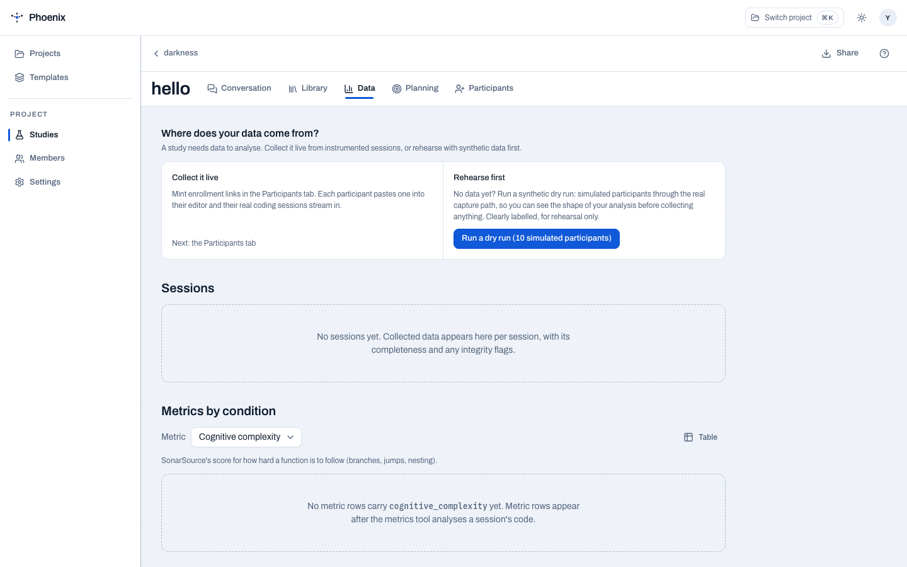
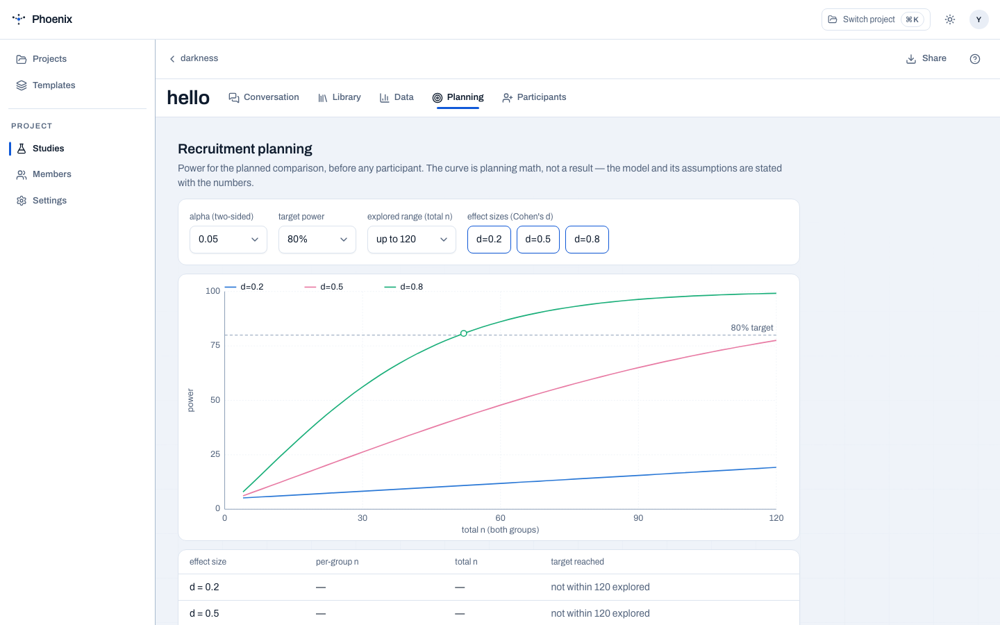

# Data

The Data tab is where collection, curation, and the analysis handoff live.
The platform handles design, setup, and curation  -  then stops: you get the
data, a data dictionary, and an analysis plan, ready for your own notebook.

<figure markdown="span">
  { width="800" }
  <figcaption>Collection status, dry runs, and the analysis handoff.</figcaption>
</figure>

## Two data paths, one schema

- **The live path**  -  cognitive (self-report), behavioural, static-metrics, and
  agent instrument legs, configured per study from the protocol.
- **The curated path**  -  archive import adapters, with a mandatory
  validity-threats record.

Both converge on one schema, so analysis is uniform regardless of where the
events came from.

## Synthetic dry run

Before collecting anything real, run a **synthetic dry run**: simulated
participants through the real capture path. The server route
(`POST /studies/{study_id}/simulate`) and the Data tab's **Run a dry run**
button do this in-process.

```bash
uv run python -m middleware simulate pilot-2026 --count 10 --seed 42
```

The run validates the study's analysis plan against the synthetic data and
exits 0 only when every planned recipe ran. The analysis plan is proven against
data before a single real session happens.

## Recruitment planning

The Planning tab shows the power/sensitivity curve for the study's planned
comparison  -  exact two-sample t-test power across sample size, and the total n
each plausible effect size needs to reach the target. The model's assumptions
are stated alongside the numbers.

<figure markdown="span">
  { width="800" }
  <figcaption>Power across sample size, with the model's assumptions stated.</figcaption>
</figure>

## The analysis handoff

The same plan that configures instrumentation also produces the handoff:

- **`notebook`**  -  `results/<study>/notebook.ipynb`: a loaded, documented
  dataframe with every planned recipe imported  -  never run  -  plus a standalone
  `data-dictionary.md`.
- **`paper`**  -  a first-draft Methods + Results paper section from the same
  plan.
- **`run` / `validate` / `list`**  -  execute recipes, check plan satisfaction,
  and catalogue what exists.

!!! warning
    The demo study's data is synthetic and must never be presented as a
    finding. Anything shown in `demo-study` is illustrative.