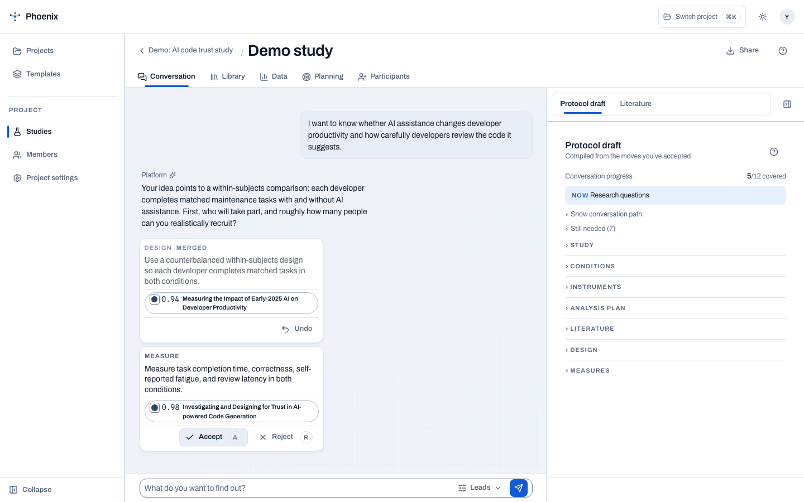

# Design conversation

The design conversation is the platform’s methodologist at the edge of the
desk. You describe what you want to learn; PHOENIX asks what must be true for
the answer to be interpretable, then proposes one decision at a time.

The live design loop uses Mistral Medium (`mistral-medium-latest`) through
Mistral's EU service because its output is short, structured, and latency
sensitive. Citation-heavy knowledge answers continue to use Mistral Large.
Configure `MISTRAL_API_KEY` on the middleware; `MISTRAL_DESIGN_MODEL` can
override the design model when needed. If the key is unavailable, PHOENIX
shows an honest offline state instead of presenting scripted replies as live
reasoning.

<figure markdown="span">
  { width="900" }
  <figcaption>Every move is reviewable, reversible, and connected to the protocol draft.</figcaption>
</figure>

## A move, not a magic answer

1. **Describe the question.** Start with the phenomenon, population, task, and
   comparison you care about.
2. **Inspect the proposal.** A move might choose a within-subjects design,
   define a measure, add a condition, or set a participant-count rule.
3. **Check the evidence.** Each citation chip points back to the literature
   corpus with a confidence score. If no source supports the move, the UI says
   **unsourced**.
4. **Accept or reject.** Accepted moves compile into the protocol draft;
   rejected moves leave no hidden configuration behind.

The point is not to outsource judgement. The point is to make judgement
explicit, evidenced, and easy to audit later.

## The interaction contract

The conversation is a design session, not an infinite transcript.

- One focused question is visible at a time.
- At most one decision card is offered for that question. A grounded caution
  takes priority over a new protocol choice when both arrive together.
- Accepting, rejecting, or noting a card records the decision and advances the
  session. The synthetic acknowledgement is not treated as a new research idea.
- Earlier decisions fold into a compact history. The active answer and its next
  decision stay in view; the researcher does not have to reread the whole
  conversation to continue.
- The draft rail is a live summary, not a second transcript. It shows the eight
  researcher-controlled sections, the next missing decision, and any compiler
  error that blocks application.

The assistant keeps a short conversational window and relies on the structured
move ledger plus compiled draft for durable state. This prevents old prose from
making replies slower or causing accepted decisions to be proposed again.

## Move and response rules

The design model returns schema-checked JSON. Its response is deliberately
small: two short sentences at most, one question, and one move. A move is either
a protocol patch, an executable analysis recipe, or a caution. Analysis moves
must name a runnable recipe such as `paired-nonparametric`; free-form prose is
not an analysis plan. Instrument moves must use a registered instrument name.

The compiler remains the authority. The browser preview updates immediately from
accepted moves, then the server compiles and validates the protocol before the
researcher can apply it. Invalid or legacy moves are surfaced as warnings or
errors rather than being silently shown as completed protocol sections.

## Grounding is a type, not a tone

Every proposal is exactly one of:

- **Cited** — backed by papers in the corpus, with the supporting literature
  visible in the move card.
- **Unsourced** — a useful possibility that has no supporting paper in the
  available corpus and must not be mistaken for evidence.

There is no third state. Clicking a citation opens the paper in the study’s
Library, where the researcher can inspect its place in the constellation.

## Steering the assistant

The **Steer** control adjusts how assertively the assistant drives the next turn.
High steer proposes more aggressively; low steer asks more and presumes less.
It changes the next response, not the protocol already accepted.

## What the assistant will not do

- Fabricate a citation or imply that an unsourced move is literature-backed.
- Silently rewrite an accepted protocol decision.
- Present demo or synthetic data as a result.
- Replace the researcher’s ethics review, preregistration, or final analysis.

The [protocol draft](protocol-draft.md) is the document of record; the
conversation is the trace of how it became that way.
