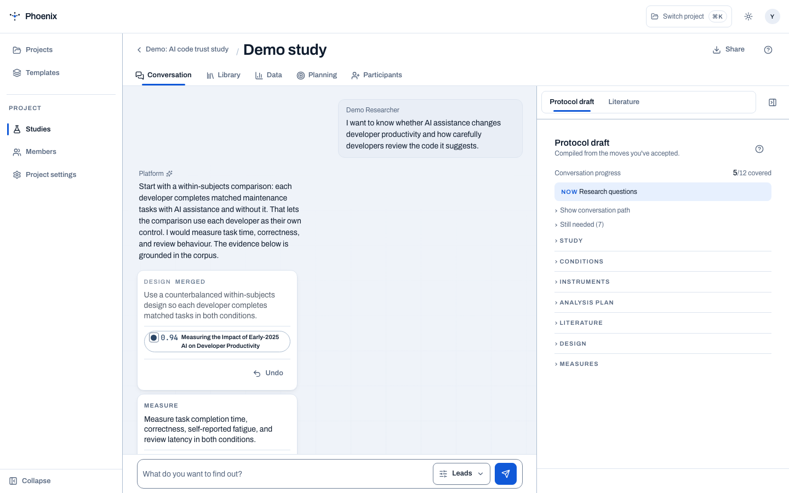
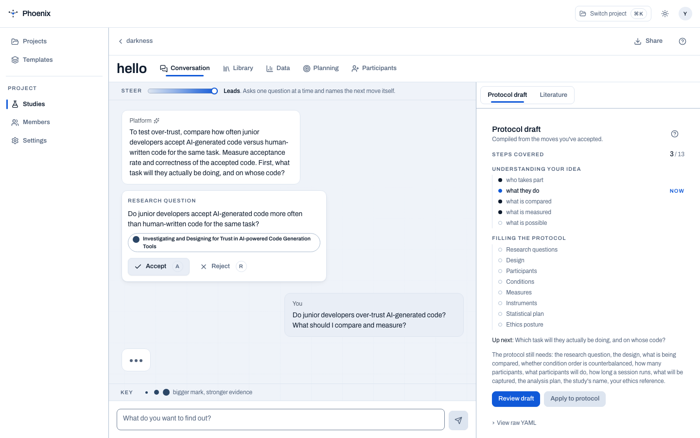

# Design conversation

The heart of the platform. You describe a research idea in plain English;
PHOENIX asks the questions a research methodologist would, and proposes
**design moves**  -  concrete design choices, each grounded in the published
literature or plainly marked unsourced.

<figure markdown="span">
  { width="800" }
  <figcaption>Proposals arrive one at a time; you accept or reject each.</figcaption>
</figure>

## How it works

1. **Describe your idea.** Type what you want to find out, e.g.
   *"Do junior developers over-trust AI-generated code? What should I compare
   and measure?"*
2. **Rule on proposals.** The assistant proposes one design move at a time  -
   a design shape, a measure, a comparison, a participant-count rule. Every
   move card carries its source: a real citation, or an explicit
   "no source found" label.
3. **Accept or reject.** Accepted moves compile into the protocol draft in real
   time. Rejected moves are dropped; the assistant adapts.

## Grounding is a type, not a tone

Every proposal is either:

- **Cited**  -  backed by one or more papers from the ~15,000-paper corpus, with
  a confidence score and citation chips; or
- **Unsourced**  -  explicitly labelled, when no supporting paper exists.

There is no third state, and the UI never lets one masquerade as the other.
Click any citation chip to open the paper in the literature library.

## The Steer dial

At the head of the conversation thread sits **Steer**, a dial from high to low
that governs how much the assistant drives the conversation. High steer means
the assistant proposes aggressively; low steer means it asks more and
presumes less. The dial is continuous and takes effect on the next turn.

<figure markdown="span">
  { width="800" }
  <figcaption>The streaming conversation with the protocol draft compiling alongside.</figcaption>
</figure>

## Design session card

The hero surfaces a **design session** card for quick access to a fresh
conversation  -  open it, type an idea, and the assistant starts proposing
immediately.

## What the assistant will not do

- It will not fabricate a citation. No source, no citation.
- It will not let the chat outrank the compiled draft  -  the
  [protocol document](protocol-draft.md) is the single record of the study.
- It will not present demo or synthetic data as findings.