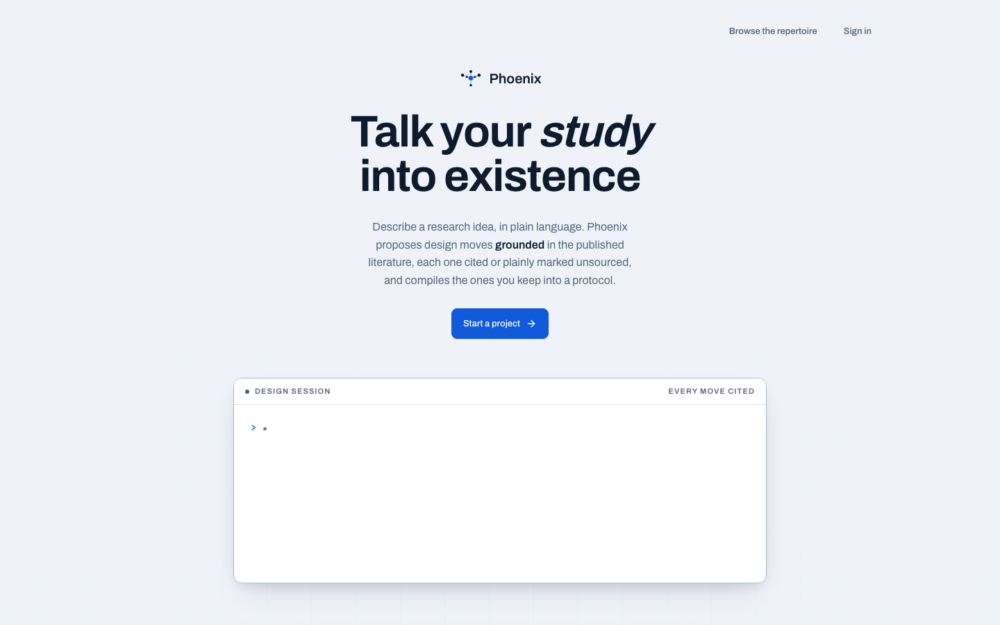

# PHOENIX Platform

## The study desk, from first question to clean hand-off

PHOENIX is the web application where a researcher turns an idea into a study
that another person can actually run. It keeps the conversation, protocol,
participant setup, live data checks, literature, and analysis hand-off on the
same study spine.

<figure markdown="span">
  { width="900" }
  <figcaption>The current home page: a grounded design session is the product's first move.</figcaption>
</figure>

## The researcher’s loop

1. **Design.** Explain the question in ordinary language. PHOENIX asks the
   methodologist’s follow-up questions and offers one concrete design move at a
   time.
2. **Compile.** Accept the decisions you mean to keep. The protocol draft,
   analysis plan, consent statement, and capture config compile deterministically
   from those decisions.
3. **Rehearse.** Run synthetic participants through the same ingest and plan
   validation used for a real session. Fix missing measures or sequence problems
   before recruiting anyone.
4. **Coordinate.** Mint one participant link per person. The link carries the
   approved study configuration into TERN, with counterbalanced task assignment.
5. **Inspect.** Watch session integrity and distinguish complete data from
   sequence gaps, synthetic fixtures, and data collected outside the link flow.
6. **Hand off.** Export the schema, data dictionary, notebook scaffold, and
   analysis recipes so the research team can continue in its own tools.

## What belongs in the platform

| Area | Researcher-facing job | Output that matters |
| --- | --- | --- |
| Conversation | Make design choices explicit and evidence-aware | Accepted design moves |
| Protocol draft | Show what the study currently means | Versioned, validated protocol |
| Planning | Make sample-size assumptions visible | Power/sensitivity curve |
| Participants | Connect a person to one study run | Pairing token and assignment |
| Data | Rehearse, monitor, and curate | Integrity-aware dataset |
| Library | Inspect proven shapes and supporting papers | Reusable design evidence |

<figure markdown="span">
  { width="900" }
  <figcaption>A live study view: the conversation proposes a counterbalanced design while the protocol rail shows what is covered and what is still missing.</figcaption>
</figure>

## Where TERN enters

The platform does not pretend to be the participant’s editor. On **Participants**
it tells the researcher which TERN release to install, then mints a one-use
pairing link. TERN redeems that token, displays the protocol-derived consent
statement, stores the approved capture configuration, assigns the participant’s
condition, and streams only the permitted event shapes back to middleware.

This is one contract, not two disconnected demos:

```text
PHOENIX protocol
      │ consent + capture config + assignment
      ▼
TERN in VS Code ── local JSONL first ──► middleware ──► PHOENIX Data
```

See [Participants](participants.md) for pairing and [TERN’s captured data](../extension/captured-data.md)
for the event contract.

## Local setup

The platform uses Clerk in production. Locally, leave `MIDDLEWARE_AUTH` unset
to use the single-process development server without authentication.

```bash
uv sync --all-packages
(cd platform && npm ci && npm run build)
uv run python -m middleware corpus-import
uv run python -m middleware serve
```

The design conversation needs `MISTRAL_API_KEY` and uses only Mistral Large
(`mistral-large-latest`) through Mistral's EU service. There is no alternate
gateway or model setting. The compiled protocol, dry run, pairing, and analysis
paths do not need a model key.
