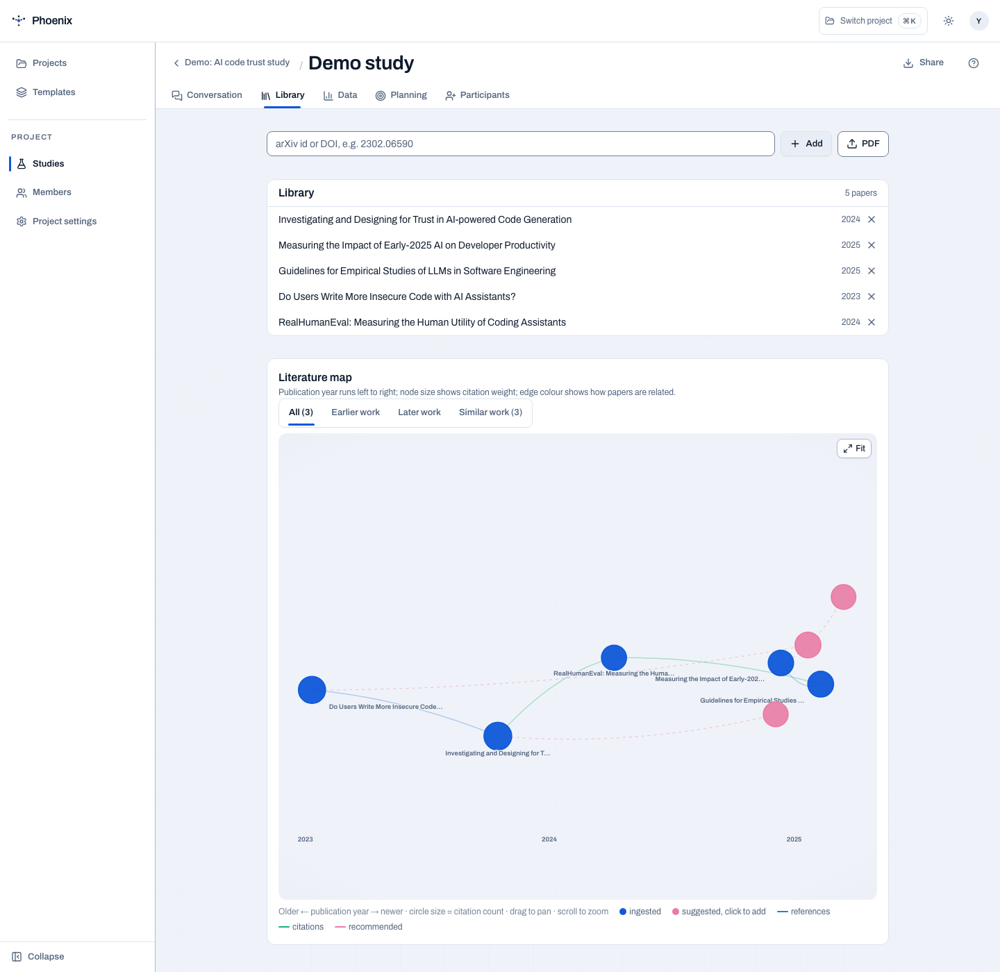

# Library

The Library is PHOENIX’s evidence surface: proven protocol shapes on one side,
the literature constellation behind them on the other. It lets a researcher
reuse a method without treating reuse as a black box.

<figure markdown="span">
  { width="900" }
  <figcaption>Five papers, their relationships, and the study’s evidence trail in one working view.</figcaption>
</figure>

## Protocol repertoire

Design shapes are ranked by how widely the corpus uses them. Each shape carries
the statistical plan it requires; merging shapes creates a novel protocol while
retaining every supporting reference.

Examples include:

- **Single-arm benchmark evaluation** — descriptive measures only, with no
  inferential comparison;
- **Self-report-only AI-assistance study** — within-subject experience measures;
- **Within-subject human–AI synergy comparison** — matched human-only,
  AI-only, and collaborative conditions with explicit synergy measures.

The repertoire is a starting point. The researcher still decides whether the
shape fits the question, population, task, and ethics boundary.

## Literature constellation

Citation chips from the design conversation open the supporting paper in the
constellation: its position in the corpus, confidence score, and the moves it
supports. The platform distinguishes a citation from an unsourced suggestion
at the data-model level, not just by styling.

## Corpus provenance

Local development can import the project corpus with:

```bash
uv run python -m middleware corpus-import
```

Grounding is a type, not a tone: every proposal is cited or explicitly
unsourced. That distinction travels with the protocol and remains available in
the analysis and ethics hand-off.
