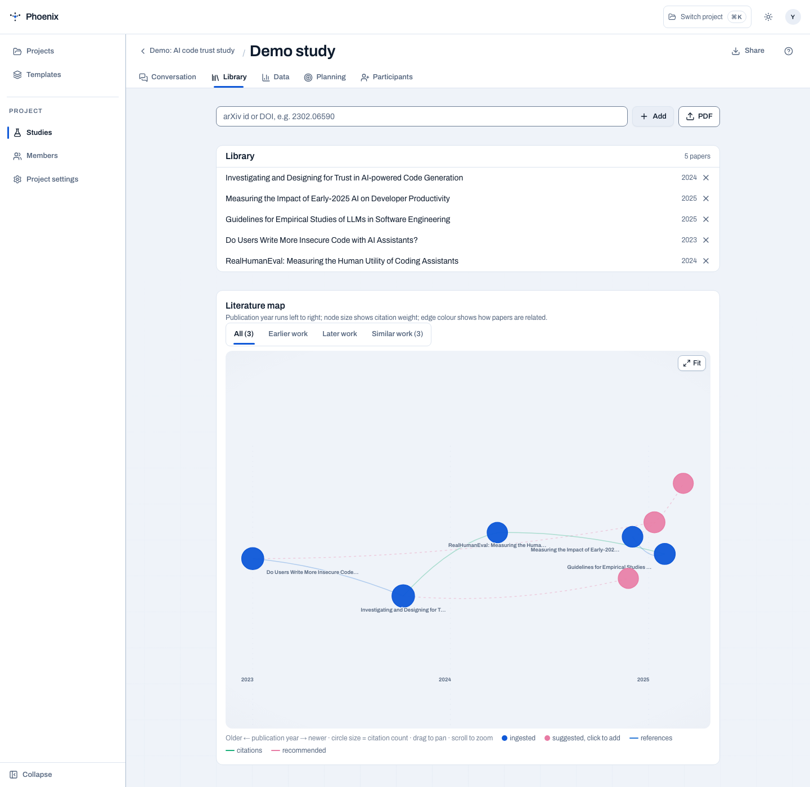

# Library

The Library is PHOENIX’s evidence surface: described protocol shapes on one side,
the literature constellation behind them on the other. It lets a researcher
reuse a method without treating reuse as a black box.

<figure markdown="span">
  { width="900" }
  <figcaption>An example literature library, its relationships, and the study’s evidence trail.</figcaption>
</figure>

## Protocol templates

Design shapes are ranked by how widely the corpus uses them. Each shape carries
the statistical plan it requires and keeps its supporting references.

Examples include:

- **Single-arm benchmark evaluation** — descriptive measures only, with no
  inferential comparison;
- **Self-report-only AI-assistance study** — within-subject experience measures;
- **Within-subject human–AI synergy comparison** — matched human-only,
  AI-only, and collaborative conditions with explicit synergy measures.

The templates are a starting point. The researcher still decides whether the
shape fits the question, population, task, and ethics boundary.

## Literature constellation

Citation chips from the design conversation open the supporting paper in the
constellation: its position in the corpus, confidence score, and the moves it
supports. The platform distinguishes a citation from an unsourced suggestion
at the data-model level, not just by styling.

## Corpus provenance

Local development can import the project corpus with:

```bash
uv run python -m middleware corpus-import
```

Grounding is a type, not a tone: every proposal is cited or explicitly
unsourced. That distinction travels with the protocol and remains available in
the analysis and ethics hand-off.

## Keeping the library current

A refresh searches arXiv and Semantic Scholar for recent metadata and stores
unseen papers as candidates. It does not fetch PDFs. Candidates are not searchable
until a researcher accepts them. The Evidence tab shows when the last refresh ran
and how many candidates await review; an incomplete or failed refresh is identified.

```bash
uv run python -m middleware corpus-refresh --dry-run
uv run python -m middleware corpus-refresh
uv run python -m middleware corpus-candidates --limit 20
uv run python -m middleware corpus-decide --ref arxiv:2610.00000 --decision accept --note "Reviewed title and abstract; relevant to this study area"
uv run python -m middleware corpus-decide --ref arxiv:2610.00001 --decision reject --note "Model benchmark without developer participants"
```

The example references are placeholders; review actual candidates before deciding.
Accepting is permanent in v1. Accepted papers are tier C, keep their review note,
and live in the database: back up that database. They do not count toward completion
of the checked-in core corpus. Rejecting a candidate excludes it from later imports.

Queries are configured in `docs/papers/refresh-queries.json`, or in a file selected
by `MIDDLEWARE_REFRESH_QUERIES`. Set `MIDDLEWARE_REFRESH_INTERVAL_H=6` to enable
an optional six-hour scheduler; leave it empty for manual refreshes. Every refresh
records its window, counts, and source errors. Only a fully successful run advances
the date watermark; retries overlap by one day. Recent concurrent runs are refused.

arXiv requests are paced to at least three seconds apart. Semantic Scholar requests
use its existing rate limiter and bounded retries; keyless requests can receive 429
responses. A failed source produces a partial run when another source succeeds.
Set `S2_API_KEY` if available and `MIDDLEWARE_REFRESH_CONTACT_EMAIL` for an arXiv
contact address. No source failure silently counts as a successful refresh.

Paper metadata includes data from Semantic Scholar and arXiv. Recommendation
abstracts are omitted from conversation exports and replication kits; this also
keeps Semantic Scholar abstracts out of those exports. Uploaded researcher files
remain the researcher's responsibility. Confirm Semantic Scholar caching terms
with AI2 before deploying abstract storage for other users (open decision D11).
