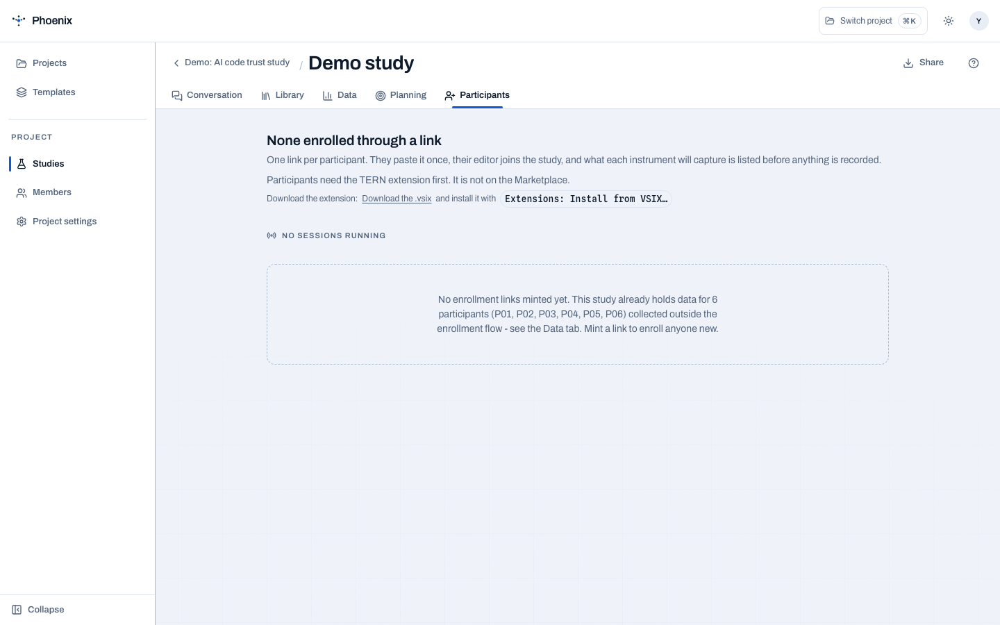
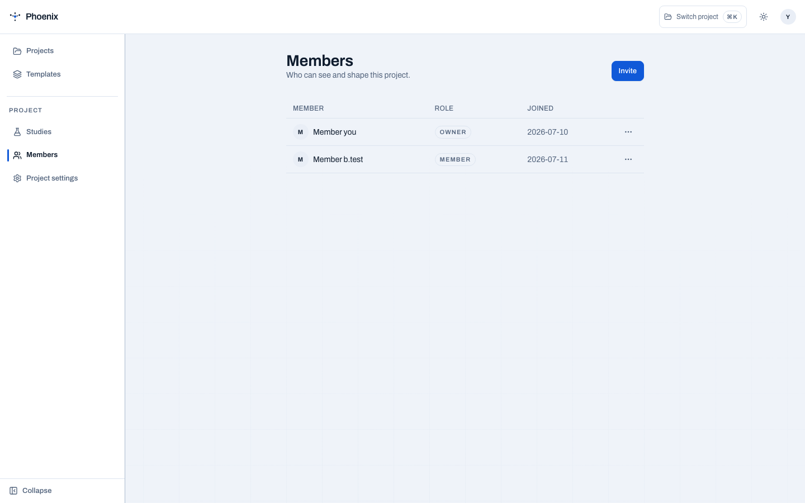

# Participants

The Participants tab coordinates who runs your study and how conditions are
assigned. The protocol configures TERN on each participant's machine, and task
order is rotated so every participant meets every condition.

<figure markdown="span">
  { width="800" }
  <figcaption>Create participant links that install the study on the editor.</figcaption>
</figure>

## Participant links

A click produces a participant link (`vscode://…/pair` deep link). Opening it
in VS Code installs the study on that machine  -  consent statement, capture
config, everything  -  already configured exactly as designed. No per-machine
setup, no configuration drift.

## Counterbalanced assignment

Task order is rotated automatically so every participant meets every condition
in a different order  -  the study you designed is the study that runs.

## Projects, roles, and invitations

Participants, researchers, and viewers are managed through projects:

| Role | What they can do |
| --- | --- |
| Owner | Full control: projects, roles, invitations, protocol, data |
| Researcher | Collaborate on the same study: conversation, participants, data |
| Viewer | Read-only access |

<figure markdown="span">
  { width="800" }
  <figcaption>Project membership and roles.</figcaption>
</figure>

## Before collecting anything

Run a **synthetic dry run** first: simulated participants through the real
capture path, so the analysis plan is proven against data before a single real
session happens. See [Data](data.md).