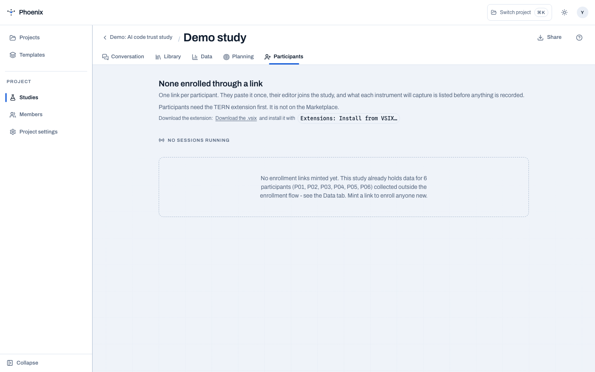

# Participants

Participants is the bridge between a protocol on the platform and a person in
VS Code. It makes the install, consent, assignment, and capture boundary
visible before anyone starts a real session.

<figure markdown="span">
  { width="900" }
  <figcaption>Install the exact TERN release first, then create a one-use link for each participant.</figcaption>
</figure>

## The hand-off contract

1. The researcher installs the [TERN 1.0.1 release](https://github.com/idreesshaikh/human-ai-studies-framework/releases/tag/v1.0.1)
   into VS Code with **Extensions: Install from VSIX…**.
2. PHOENIX creates a participant-specific, one-use enrollment token.
3. The participant opens the link (`vscode://…/pair`) in VS Code.
4. TERN redeems the token, shows the consent statement, stores the approved
   capture configuration, and receives the participant’s assignment.
5. Events are written locally first and optionally mirrored to the middleware;
   the platform can then show session integrity in **Data**.

The deep link is intentionally not an installer. TERN is a GitHub-release VSIX,
not a Marketplace package, so the participant installs it once before pairing.

## Choose the study folder

A participant link can open the task's folder in VS Code right
after consent. In **Create participant links**, set the **Study folder** once for the study,
in one of two ways:

- **A path** that already exists on participants' computers, such as
  `/home/participant/study-task`, `~/study-task`, `C:\study\task` or a
  `file://` address. Use this when the study kit is delivered separately.
- **A zip** of the folder (up to 50 MB). TERN downloads it with the
  participant's own session credential, checks it against the uploaded hash,
  unpacks it into its own storage and opens it. A zip with one top-level
  folder opens that folder.

If no folder is set here, TERN falls back to the task's `materials` value in
the protocol when that is an absolute path. TERN never clones or downloads a
repository from a URL.

When the folder cannot be opened, pairing and consent still succeed and the
participant sees a message that names the reason, with **Open Folder…** and
**Try again** buttons. That happens when the path is relative or a web
address, the folder does not exist on the computer, the download fails or does
not match the uploaded zip, or VS Code could not open it, or the participant
is in VS Code for the web, which has no local file system. In a WSL, SSH or
container window the path is checked, and a zip is unpacked, on that window's
own machine, so a path must exist where the participant's VS Code runs (for
WSL, a Linux path such as `/home/participant/task`; for desktop Windows, a
`C:\` path).

Supported launch path: the `vscode://…/pair` deep link or **StudyLoop: Connect to
Study** in desktop VS Code. `vscode-insiders://` links are not generated.

## Assignment is part of the protocol

Task order is rotated automatically so participants meet every condition in a
counterbalanced order. The participant does not choose the condition, and the
researcher does not have to keep a spreadsheet of assignments.

## What the participant sees before recording

The pairing flow keeps three things aligned:

- **Consent statement** — why the study is running and what it captures.
- **Capture config** — the protocol-approved instrument legs and endpoint.
- **Task assignment** — the run that the analysis plan expects. The assigned
  condition is never shown to the participant; it stays in the study's records
  and is stamped on every event by the server.

TERN’s preflight summary is the last gate. No session file is created until the
participant confirms **Begin session**.

## Projects, roles, and invitations

| Role | What they can do |
| --- | --- |
| Owner | Projects, roles, invitations, protocol, participants, and data |
| Researcher | Collaborate on the conversation, participants, and data |
| Viewer | Read-only access |

Run a small pilot with a few real participants first, and tag those sessions as
pilot in the [Data tab](data.md). Pilot sessions stay in the export but are kept
out of confirmatory analysis.
