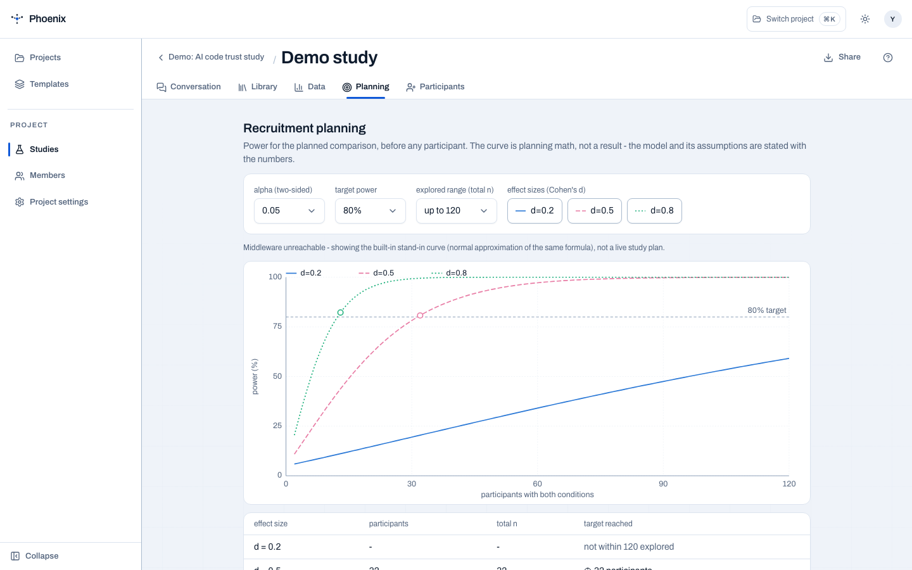

# Planning

Planning turns the protocol's comparison into a recruitment boundary. It is
where the researcher explores how many observations may be needed before
inviting anyone; it is not a report of results from participants.

<figure markdown="span">
  { width="900" }
  <figcaption>The Planning tab shows the target, explored range, effect-size curves, and the first total <code>n</code> that reaches the target.</figcaption>
</figure>

## What the controls mean

- **Alpha (two-sided)** — the significance threshold used by the planning
  calculation.
- **Target power** — the probability target the curve tries to reach, such as
  80% or 90%.
- **Explored range (total n)** — the largest total sample size plotted. It is a
  search boundary, not a recommendation to recruit that many people.
- **Effect sizes (Cohen's d)** — the plausible differences to compare. Toggle
  curves on or off to keep the chart readable while checking small, medium,
  and large effects.

The table below the chart reports the first total `n` at which each selected
curve reaches the target. If a curve never reaches it within the explored
range, Planning says so instead of inventing a sample size.

## How to use it

1. Finish the comparison, conditions, and primary measure in the conversation.
2. Open **Planning** and choose assumptions that are defensible for the study,
   not simply the most optimistic effect size.
3. Compare the recruitment number against the people you can realistically
   reach. A small feasible study can still be useful, but its conclusions may
   be exploratory.
4. Revisit the curve whenever the design changes. The protocol and the
   planning assumptions should describe the same comparison.

When middleware is unavailable, the tab labels the built-in stand-in curve
explicitly. It is useful for understanding the interface and the calculation,
but it is not a live study plan or evidence from participants.

## What Planning does not decide

The curve does not choose your population, task, outcome, or ethics posture.
It also does not turn a target into a guarantee: the researcher still owns the
assumptions, feasibility judgment, and final analysis plan.
