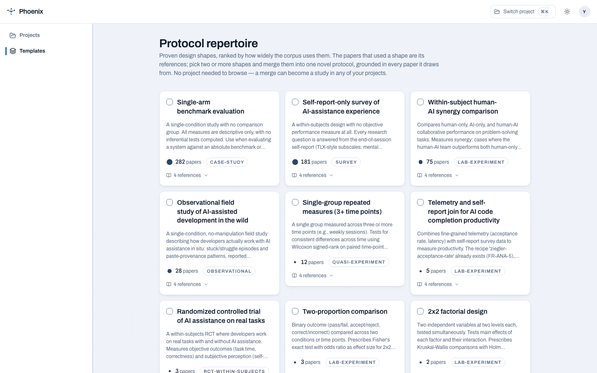

# Protocol draft

As you accept design moves in the conversation, the **protocol draft** compiles
beside them  -  deterministically. The same answers always produce the same
protocol; no AI is involved in compilation.

<figure markdown="span">
  { width="800" }
  <figcaption>The compiled draft, live beside the conversation.</figcaption>
</figure>

## The document of record

The protocol is the single record of the study. The conversation is how it
comes to exist, but the compiled protocol is what gets validated, versioned,
and eventually run. The UI never lets the chat outrank the compiled draft.

## What compilation means

- **Deterministic.** Accepted choices compile through the protocol schema into
  versioned YAML. No randomness, no LLM in the loop.
- **Diffed.** Every change is shown as a diff against the previous version
  before it is applied.
- **Validated.** If something is missing  -  a condition, a measure, a
  participant-count rule  -  the protocol tells you exactly what.
- **Approved, not automatic.** Diffs are applied only on human approval.

## Consent and responsibility

PHOENIX does not approve research or replace an institution's ethics process.
It makes the capture decision explicit: the participant sees the protocol-derived
consent statement before pairing, and the approved capture configuration is what
TERN applies for the run. The researcher remains responsible for institutional
approval and for deciding whether a later study run needs a new review.

There is no lifecycle board or mid-study amendment workflow. PHOENIX's boundary
is deliberate: it designs, sets up, and curates the study, then hands off the
dataset and analysis plan.

## The repertoire it draws from

Proven design shapes from the [protocol repertoire](library.md) are ranked by
how widely the corpus uses them. Each shape binds its statistical plan  -  the
exact tests, effect sizes, and per-cell-n rules it requires. Merging two or
more shapes produces a novel protocol grounded in every paper it draws from.

{ width="800" }
