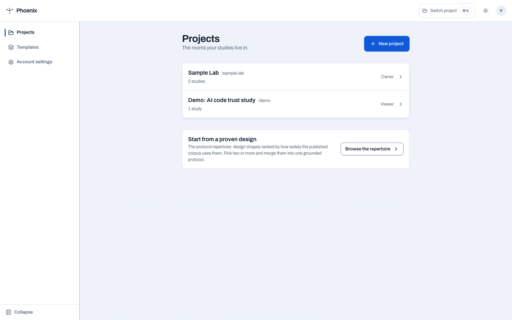
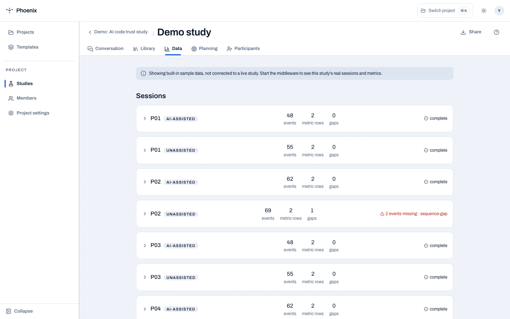

# Platform quick start

Get from a question to a rehearsed participant hand-off without leaving the
study workspace. The shortest useful demo uses the local platform, the seeded
demo study, and the TERN lab in the repository.

## 1. Start the platform

Prerequisites: [uv](https://docs.astral.sh/uv/), Node 22, and a
[Mistral API key](https://console.mistral.ai/) for the design conversation.
Short design turns use Mistral Medium (`mistral-medium-latest`) through
Mistral's EU service; citation-heavy knowledge answers use Mistral Large.
Set `MISTRAL_DESIGN_MODEL` only when you need to override the design default.

```bash
git clone https://github.com/idreesshaikh/human-ai-studies-framework.git
cd human-ai-studies-framework

uv sync --all-packages
(cd platform && npm ci && npm run build)
echo "MISTRAL_API_KEY=sk-..." >> .env
uv run python -m middleware corpus-import
uv run python -m middleware serve
```

Open <http://localhost:8000>. Without `MIDDLEWARE_AUTH`, local mode serves the
platform without sign-in. `docker compose up` is the alternative when you want
the containerized stack.

## 2. Start with a project

<figure markdown="span">
  { width="900" }
  <figcaption>A project keeps studies, collaborators, evidence, and data under one research boundary.</figcaption>
</figure>

1. Choose **Start a project**, or open a proven design from **Templates**.
2. Create a study and open **Conversation**.
3. Describe the question, population, task, and comparison in plain language.
4. Answer one focused question at a time. Accept, reject, or note one decision
   card before moving on. A citation chip means the move is grounded; an
   explicit unsourced label means it is not.

<figure markdown="span">
  { width="900" }
  <figcaption>The conversation and protocol draft stay side by side, so a design decision has a visible downstream consequence.</figcaption>
</figure>

## 3. Compile before you recruit

Open the protocol rail and resolve the sections marked **Still needed**. The
compiler turns accepted moves into the protocol that will drive consent,
assignment, instrumentation, and analysis. Review the diff and validation
messages before approving a version.

Then open **Planning** to inspect the power curve and the assumptions behind the
planned comparison. This keeps a sample-size decision attached to the design it
belongs to rather than hidden in a later notebook.

## 4. Rehearse the real data path

From **Data**, run a synthetic dry run before a real participant arrives:

```bash
uv run python -m middleware simulate pilot-2026 --count 10 --seed 42
```

The command drives the capture path and validates every planned analysis recipe.
It exits successfully only when the plan is satisfied. Synthetic rows are
labelled as such; they are a plumbing test, not evidence.

<figure markdown="span">
  { width="900" }
  <figcaption>The Data view keeps complete sessions and a deliberate sequence-gap warning visible at the same time.</figcaption>
</figure>

## 5. Hand the study to TERN

Open **Participants** and install the release artifact before minting links:

1. Download `tern-1.0.1.vsix` from the [GitHub release](https://github.com/idreesshaikh/human-ai-studies-framework/releases/tag/v1.0.1).
2. In VS Code, run **Extensions: Install from VSIX…**.
3. Mint one link for each participant and send it to the matching person.
4. The participant opens the link, reads consent, and starts with the assigned
   condition already configured.

<figure markdown="span">
  { width="900" }
  <figcaption>The platform makes the sideloaded TERN release and the participant path explicit before a session starts.</figcaption>
</figure>

## 6. Produce the analysis hand-off

The same protocol drives the data dictionary, recipes, and notebook scaffold:

```bash
uv run python -m analysis.cli notebook protocol/examples/pilot-study.yaml --server http://127.0.0.1:8000
uv run python -m analysis.cli paper protocol/examples/pilot-study.yaml
```

Use `run`, `validate`, and `list` to execute, verify, and catalogue recipes.
The research team keeps ownership of the final analysis and institutional ethics
decisions; PHOENIX makes the path reproducible and inspectable.
