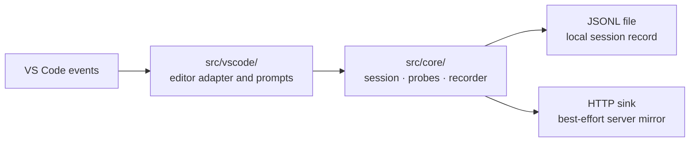

# TERN development

TERN captures editor behavior and self-report measures during a configured study
session. It records locally and can mirror events to PHOENIX.
See the [extension overview](../README.md) and
[framework architecture](../../docs/architecture.md).

## Architecture



`src/core/` must not import `vscode`. It contains the session clock, survey
definitions, capture filters, consent logic, detectors, and event schema.
`src/vscode/` supplies editor events, prompts, pairing, sinks, and activation.
The live pairing implementation is in `src/vscode/pairing.ts`.

Keep timing and classification logic in the core so it can be tested without
launching an editor. Sensor or network failure must not interrupt a participant.
Preserve local recording, bounded retries, and sequence continuity.

## Develop and test

Use Node.js 22+ and a VS Code version satisfying `engines.vscode` in
`package.json`.

```bash
npm ci
npm run compile
npm run check
```

Open this directory in VS Code and press F5 to launch the Extension Development
Host. Open `examples/tern-lab/` in that host and connect using a participant
link. `npm run watch` rebuilds changes; reload the development host to use them.
`npm run package` produces the installable VSIX.

Tests in `test/` use Node's test runner and mocked timers. Changes to timing,
consent, identity, or capture filters need regression coverage.

## Capture contract

`src/core/types.ts` defines `StudyEvent` and `SCHEMA_VERSION`.
`Recorder` stamps session identity, participant, condition, sequence, and time.
Version changes to event meaning or shape and update their consumers.

`package.json` is the settings reference. Paired sessions use the protocol's
configuration; participant-side settings cannot silently override the assigned
condition or capture scope.

TERN excludes raw source, keystrokes, and clipboard contents. Signals such as
edit origin and stuck detection are heuristics, with limitations documented in
[adaptation notes](adaptation-notes.md). Do not present them as ground truth.

Update `CHANGELOG.md` when changing the extension. See
[troubleshooting](troubleshooting.md) for recording and connection failures.
