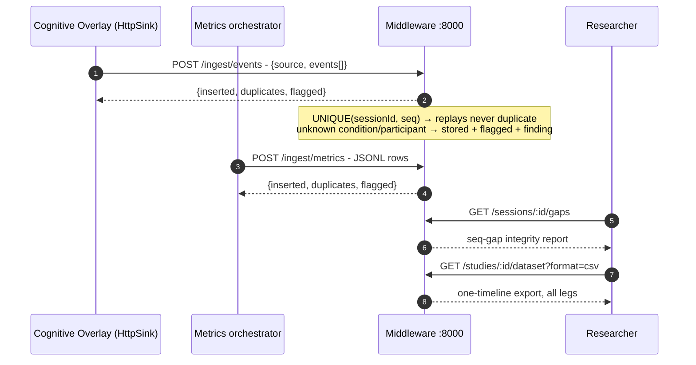

# Ingestion middleware (`:8000`)

The service every leg reports to (FR-ING-1..6): idempotent ingest of
extension StudyEvents and static-metrics rows, artifact uploads, seq-gap
integrity reports, and the joined one-timeline dataset export that theplatform and analysis recipes consume. Storage is a single SQLite file
under `.study-data/` (gitignored - participant data never enters git).



## Run locally

```bash
uv run python -m middleware                       # port 8000
MIDDLEWARE_PROTOCOL=protocol/examples/pilot-study.yaml \
  uv run python -m middleware                     # protocol-aware (FR-ING-6)
```

Config (env): `MIDDLEWARE_PORT`, `MIDDLEWARE_DB`, `MIDDLEWARE_DATA_DIR`,
`MIDDLEWARE_PROTOCOL`. With a protocol loaded, ingested rows whose
condition isn't declared - or whose participant is outside the plan
(convention `P1..P<planned>`) - are stored **and flagged**, never dropped,
and each flagged batch is logged to `/findings` (FR-META-1).

## Run in Docker

```bash
docker compose up                  # middleware + demo-seed (sample session)
docker compose --profile sonar up  # ... plus SonarQube on :9000
```

## Point the Cognitive Overlay at it

Set (or derive from the protocol - they are the same thing):

```bash
uv run protocol derive overlay-settings protocol/examples/pilot-study.yaml \
    --participant P01 --condition ai-assisted
```

The relevant setting is
`"cognitiveOverlay.output.httpEndpoint": "http://127.0.0.1:8000/ingest/events"`.
The extension needs **zero code changes**: its HttpSink already POSTs
`{"source": "cognitive-overlay", "events": [...]}` batches.

## Smoke test

With the server running:

```bash
uv run python middleware/scripts/replay_session.py
```

Replays the bundled sample session (containing a deliberate seq gap) twice
- the second pass reports only duplicates (FR-ING-2) - then prints the gap
report (FR-ING-3) and the one-timeline dataset summary (FR-ING-4).

## Endpoints

| Method & path | Purpose |
| ------------- | ------- |
| `POST /ingest/events` | StudyEvent batches (HttpSink wire format or bare array); idempotent on `(sessionId, seq)` |
| `POST /ingest/metrics` | static-metrics JSONL rows; idempotent on content hash |
| `POST /ingest/files` | artifact upload (session JSONL, consent PDFs); content-addressed |
| `GET /studies/{id}/sessions` | sessions with per-leg row counts |
| `GET /sessions/{id}/events` | events, filterable by `type`/`since`/`until` |
| `GET /sessions/{id}/gaps` | seq-gap integrity report |
| `GET /studies/{id}/dataset` | one-timeline export, `?format=json\|csv` |
| `GET /studies/{id}/protocol` | protocol summary for the platform overview + trace chips (MP-06) |
| `GET /studies/{id}/lifecycle` | computed phase + per-gate satisfaction from uploaded artifacts (FR-DASH-2) |
| `GET /studies/{id}/status` | factual status doc the task board derives its cards from (FR-DASH-7) |
| `GET /studies/{id}/live` | sessions with ingests in the last 5 min + rate buckets (FR-DASH-3) |
| `GET /files` | uploaded artifact index |
| `POST/GET /findings` | operational-findings log (FR-META-1; full wiring MP-11) |
| `POST/GET/PATCH /tasks` | manual task-board cards (MP-06) |
| `GET /health` | liveness + loaded protocol |

With `MIDDLEWARE_WEB` pointing at a built SPA (default `platform/dist`,
baked into the Docker image), the middleware also serves the React platform
app at `/` and re-serves the shell for its `/p/*` and `/invitations/*` deep
links - one process is the whole stack (NFR-7). `MIDDLEWARE_TOKEN` optionally
bearer-gates the query/task endpoints; ingest stays open by design
(sensors are fire-and-forget, NFR-1). In `clerk` mode (FR-OPS-5), theme the
hosted sign-in per [`docs/clerk-appearance.md`](docs/clerk-appearance.md).
